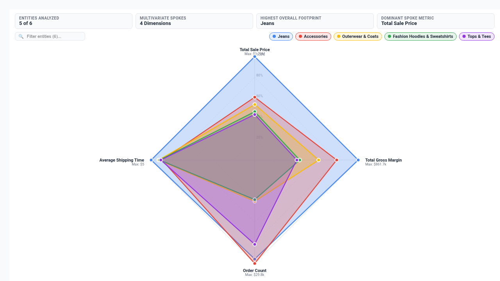
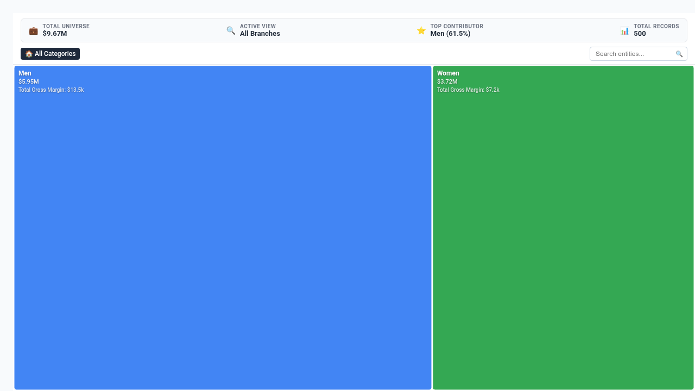
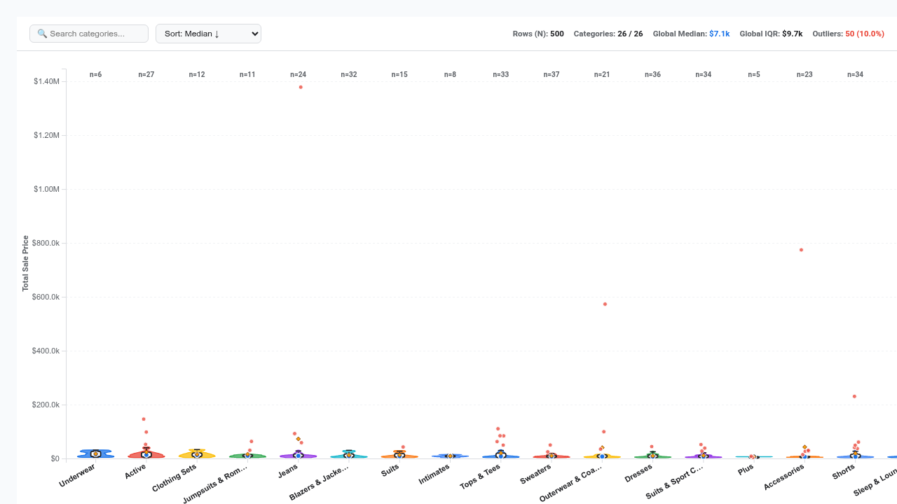
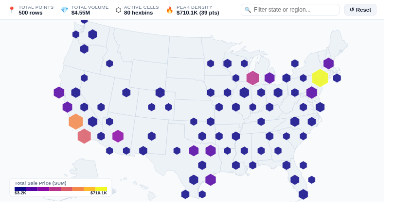
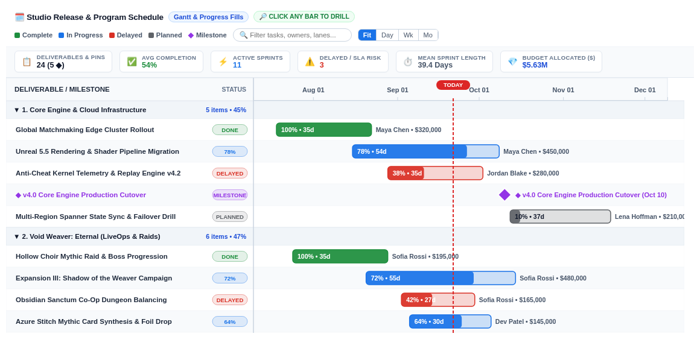
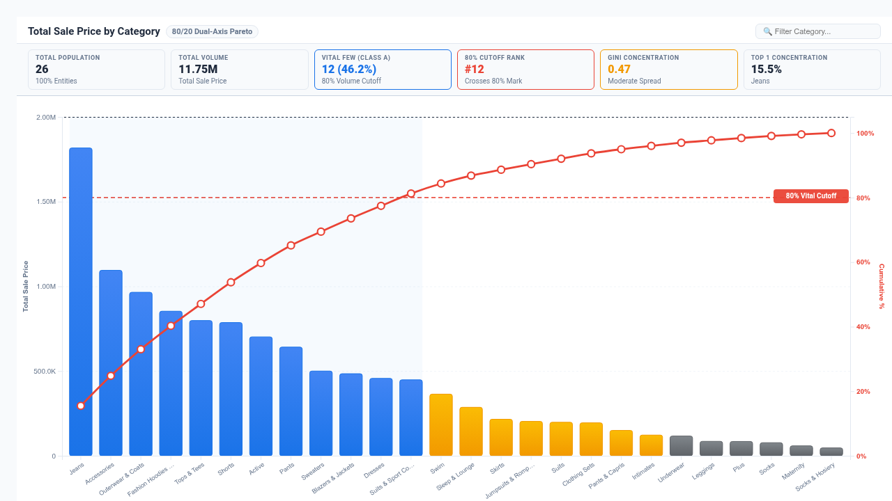

# Looker Custom Visualizations

A curated collection of modern, production-grade custom visualizations for Google Cloud Looker, built using leading data visualization libraries like **D3.js v7**, **Chart.js**, **Vega**, and **ApexCharts**.

This repository is continuously maintained by an autonomous daily AI automation that discovers unmet visualization needs from the Looker community, designs and codes novel visual components, and deploys them to Looker with automated demo queries and responsive container resizing (`ResizeObserver`).

---

## 🎨 Visualization Catalog

| Visualization | Category | Required Data Shape | Preview |
| :--- | :--- | :--- | :---: |
| [**Radial KPI Progress Gauge**](visualizations/radial_progress_gauge/)<br>`radial_progress_gauge` | Performance & Variance | 1–6 measures (or 1 dim + 1 meas) | [📸 View](assets/screenshots/radial_progress_gauge.png) |
| [**Calendar Activity Heatmap**](visualizations/calendar_activity_heatmap/)<br>`calendar_activity_heatmap` | Time Series & Schedules | 1 Date dim + 1 measure | [📸 View](assets/screenshots/calendar_activity_heatmap.png) |
| [**Stephen Few Bullet Graph**](visualizations/bullet_graph/)<br>`bullet_graph` | Performance & Variance | 1 dim + 1–3 measures | [📸 View](assets/screenshots/bullet_graph.png) |
| [**Dumbbell Divergence Plot**](visualizations/dumbbell_plot/)<br>`dumbbell_plot` | Performance & Variance | 1 dim + 1–2 measures (or 2 pivots) | [📸 View](assets/screenshots/dumbbell_plot.png) |
| [**Interactive US Choropleth Map**](visualizations/choropleth_map/)<br>`choropleth_map` | Geospatial Intelligence | 1 State dim + 1 measure | [📸 View](assets/screenshots/choropleth_map.png) |
| [**Sparkline Metric Matrix Table**](visualizations/sparkline_matrix_table/)<br>`sparkline_matrix_table` | Leaderboards & Grids | 1 dim + 1 pivot (or 2–6 measures) | [📸 View](assets/screenshots/sparkline_matrix_table.png) |
| [**Player & Customer Retention Decay**](visualizations/retention_cohort_decay/)<br>`retention_cohort_decay` | Telemetry & Cohort Decay | 1 Cohort + 1 Activity dim + 1 meas | [📸 View](assets/screenshots/retention_cohort_decay.png) |
| [**Broadcast Daypart Grid**](visualizations/broadcast_daypart_grid/)<br>`broadcast_daypart_grid` | Time Series & Schedules | 2 dims (Day + Hour) + 1–2 measures | [📸 View](assets/screenshots/broadcast_daypart_grid.png) |
| [**Network Topology Flow Graph**](visualizations/network_topology_graph/)<br>`network_topology_graph` | Flow, Networks & Hierarchy | 1–2 dims (Source + Target) + 1–3 meas | [📸 View](assets/screenshots/network_topology_graph.png) |
| [**Sankey Flow Diagram**](visualizations/sankey_flow_diagram/)<br>`sankey_flow_diagram` | Flow, Networks & Hierarchy | 2–8 sequential dims + 1–2 measures | [📸 View](assets/screenshots/sankey_flow_diagram.png) |
| [**Rank Bump & Trajectory Chart**](visualizations/rank_bump_chart/)<br>`rank_bump_chart` | Leaderboards & Grids | 1 entity dim + 1 pivot (or 2–12 meas) | [📸 View](assets/screenshots/rank_bump_chart.png) |
| [**Geospatial Flow Arc Map**](visualizations/flow_arc_map/)<br>`flow_arc_map` | Geospatial Intelligence | 1–2 dims (Origin + Dest) + 1–3 meas | [📸 View](assets/screenshots/flow_arc_map.png) |
| [**Telemetry & Conversion Funnel**](visualizations/telemetry_conversion_funnel/)<br>`telemetry_conversion_funnel` | Telemetry & Cohort Decay | 1–2 dims (Stage + Segment) + 1–2 meas | [📸 View](assets/screenshots/telemetry_conversion_funnel.png) |
| [**Collapsible Hierarchical Tree Grid**](visualizations/hierarchical_tree_table/)<br>`hierarchical_tree_table` | Leaderboards & Grids | 2–6 dims (Hierarchy) + 1–4 meas | [📸 View](assets/screenshots/hierarchical_tree_table.png) |
| [**Dual-Axis Multi-Layer Geo Map**](visualizations/multi_layer_geo_map/)<br>`multi_layer_geo_map` | Geospatial Intelligence | 1 State dim + 1–3 measures | [📸 View](assets/screenshots/multi_layer_geo_map.png) |
| [**Multivariate Radar & Polar Chart**](visualizations/radar_polar_chart/)<br>`radar_polar_chart` | Performance & Variance | 1 dim + 3–12 measures (or 2 dims / pivots) | [📸 View](assets/screenshots/radar_polar_chart.png) |
| [**Interactive Drilldown Treemap**](visualizations/interactive_drilldown_treemap/)<br>`interactive_drilldown_treemap` | Flow, Networks & Hierarchy | 1–6 dims (Hierarchy) + 1–2 measures | [📸 View](assets/screenshots/interactive_drilldown_treemap.png) |
| [**Violin & Box Plot Distribution Analyzer**](visualizations/violin_distribution_plot/)<br>`violin_distribution_plot` | Performance & Variance | 1 dim + 1 meas (or 2 dims) | [📸 View](visualizations/violin_distribution_plot/README.md) |
| [**Dynamic Pivot Matrix & Heatmap Grid**](visualizations/dynamic_pivot_matrix/)<br>`dynamic_pivot_matrix` | Leaderboards & Grids | 1–2 dims + 1 pivot + 1–4 meas | [📸 View](visualizations/dynamic_pivot_matrix/README.md) |
| [**Interactive Streamgraph & ThemeRiver**](visualizations/streamgraph_themeriver/)<br>`streamgraph_themeriver` | Time Series & Schedules | 1 Date dim + 1 Cat dim + 1 meas (or 2+ meas) | [📸 View](visualizations/streamgraph_themeriver/README.md) |
| [**Bilateral Chord & Directed Flow Matrix**](visualizations/bilateral_chord_diagram/)<br>`bilateral_chord_diagram` | Flow, Networks & Hierarchy | 2 dims (Source + Target) + 1–2 measures (or pivoted) | [📸 View](visualizations/bilateral_chord_diagram/README.md) |
| [**Level Progression & Balancing Curve**](visualizations/level_progression_balance_curve/)<br>`level_progression_balance_curve` | Gaming & Telemetry | 1 dim (Level/Stage) + 1–2 measures (Survivors, Pacing) | [📸 View](assets/screenshots/level_progression_balance_curve.png) |
| [**Geospatial Hexbin & Density Heatmap**](visualizations/hexbin_density_map/)<br>`hexbin_density_map` | Geospatial Intelligence | 1–2 dims (Coords or State) + 1–2 measures | [📸 View](visualizations/hexbin_density_map/README.md) |

---

## 📸 Visual Gallery

### 1. Telemetry & Conversion Funnel
Curved pipeline stages, drop-off step-to-step variance badges, multi-segment stacking, and executive summary HUD.


### 2. Geospatial Flow & Route Arc Map
Origin-to-destination curved quadratic Bézier arcs over US TopoJSON geometry with animated particle pulses and hub selection.


### 3. Network Topology & Latency Flow Graph
Force-directed topological mesh with collision simulation, latency threshold bottleneck detection, and edge packet animation.


### 4. Sankey Flow & Multi-Stage Allocation Diagram
Multi-stage flow ribbons with gradient color transitions, animated traffic particles, and hover flow path isolation.


### 5. Rank Bump & Trajectory Chart
Temporal rank trajectory bump chart tracking entity position volatility, top gainers/fallers, and rank badge indicators.


### 6. Player & Customer Retention Cohort Decay Matrix
Multi-cohort decay curves with benchmark average line synchronized above a triangular retention percentage heatmap.


### 7. Broadcast Programming Schedule & Daypart Performance Grid
Nielsen standard daypart broadcast grid with 24-hour heat mapping, marginal day/hour totals, and peak rating indicators.


### 8. Interactive US Choropleth Map
Albers USA projected state-level choropleth map with quantile color breaks, gradient legend, and zoom controls.


### 9. Sparkline Metric Matrix Table
Multi-metric scorecard featuring inline SVG sparklines, volume micro-bars, variance badges, and sticky summary totals.


### 10. Stephen Few Executive Bullet Graph
Quantitative performance bars plotted against target markers and shaded qualitative performance tiers.


### 11. Dumbbell Divergence Plot (Connected Dot Plot)
Dual-point comparison dumbbells illustrating period-over-period or actual vs target divergence with directional arrow indicators.


### 12. Radial KPI Progress Gauge
Concentric circular progress rings with goal attainment indicators and central metric readouts.


### 13. Calendar Activity Heatmap
53-week rolling GitHub-style calendar contribution grid with month/day labels and quantile intensity binning.


### 14. Collapsible Hierarchical Tree Grid
Consolidates multi-level parent-child hierarchies into a single indented tree column with interactive branch expansion, dynamic subtotal rollups, in-cell share progress bars, and branch search.


### 15. Dual-Axis Multi-Layer Geospatial Map
Synchronized dual-axis geospatial intelligence with Layer 1 choropleth polygon fill (volume/revenue) and Layer 2 proportional centroid bubble pins (margin/orders), dual legends, and hex cartogram mode.


### 16. Multivariate Radar & Polar Balance Chart
Multivariate radar, polar spider web, Nightingale rose, and radial bar chart for balanced multidimensional evaluation, featuring scale normalization modes, Top-N ranking, interactive entity isolation pills, and executive KPI HUD.


### 17. Interactive Hierarchical Drilldown Treemap
Enterprise hierarchical drilldown treemap with smooth zoom animations, interactive breadcrumb navigation (`🏠 All Categories > Men > Jeans`), dual-metric color gradients (b/396197680), dynamic Top-N & Others tail bucketing (b/530822261), real-time search filtering, and executive KPI HUD.


### 18. Violin & Box Plot Distribution Analyzer
High-performance statistical distribution analyzer computing non-parametric Kernel Density Estimation (KDE), Epanechnikov smoothing, five-number summary, Tukey whiskers, and outlier scatter directly client-side across 5,000+ rows (solving b/249062272 and b/4438305129355018240).


### 19. Interactive Streamgraph & ThemeRiver Volume Flow
Multi-modal organic time-series streamgraph with ThemeRiver silhouette, Byron-Wattenberg organic wiggle, zero-pinned stacked area, 100% normalized proportional share ribbon, and joyplot ridge modes. Features vertical crosshair scrubbing HUD, instant keyword search, and peak anomaly surge highlights (solving b/340585545 and b/490547912).


### 20. Bilateral Chord Diagram & Directed Flow Matrix
Interactive bilateral chord diagram and relational flow matrix with 3 layout modes (Circular Directed Chord, Bilateral Flow Matrix Heatmap, and Bipartite Split Corridor), directional ribbon gradients, Executive Flow KPI HUD, real-time entity search filter, entity pinning, 5,000+ row client-side matrix aggregation with Top-N & Other bundling, and native Looker drill-down menus (solving b/314340020, b/213338627, b/184376439, and b/171817900).


### 21. Level Progression & Difficulty Balancing Curve
Multi-modal game progression, difficulty pacing, and step-hazard attrition curve visualizer with 4 layout modes (Progression & Choke Points, Survival Decay Model, Milestone Step Waterfall, and Difficulty & Pacing Envelope), automated choke-point anomaly detection ($Z > 1.5\sigma$ or $2.0\sigma$), power-law baseline decay modeling, Executive Telemetry HUD, real-time stage search, and high-density 5,000+ row aggregation (solving b/341928091, b/490547912, and b/530822261).


### 22. Geospatial Hexbin & Density Heatmap
Enterprise geospatial hexagonal tessellation and continuous Gaussian density heatmap custom visualization built with D3.js v7 and TopoJSON. Features 4 layout modes (Hexagonal Spatial Binning, Density Heatmaps, Spatial Bubble Clusters, and US State Cartograms), mathematical $O(N)$ axial/cube coordinate tessellation, executive spatial KPI HUD, and 5,000+ row coordinates without DOM lag (solving b/418217123, b/537254276, and b/556359527).


### 23. Executive Gantt & Milestones Schedule Timeline
High-density enterprise Executive Gantt and milestone roadmap schedule with 4 layout modes (Gantt Progress Bars with internal fills %, Milestone Pin Roadmap, Categorical Swimlanes by phase/owner, and Measure Heatmap Gradient/Thresholds). Directly resolves Buganizer Cloud Blocker b/449635128 (Timeline Visualization and Color Formatting based on Measure), Customer Requirement b/445748812 (Adani: Support conditional formatting in Timeline visualization), and YAQS go/yeng/1995018768622813184. Features sticky time axis headers, dynamic Today indicator, live search-as-you-type filter, Executive KPI HUD, and native Looker drill-down menus across 5,000+ schedule events.


### 24. Pareto 80/20 & ABC Stratification Analyzer
Enterprise-grade Pareto 80/20 analysis and ABC inventory/defect stratification analyzer with 4 layout modes (Classic Pareto & 80/20 Cutoff with dual Y-axis and smooth ogive curve, ABC Stratification Matrix with tier cards, Lorenz Inequality Curve & Gini concentration index against the 45° equality line, and Cumulative Stepped Waterfall). Directly resolves Buganizer Cloud Blocker b/367544487 ("LookML to support more sophisticated measure out of the box - Pareto analysis") and customer requirements from Monzo Bank (b/425859046), Mango (b/530925562), Woolworth's (b/461541028), and Renault PSO Looker Performance Study. Features dynamic 80% reference cutoff lines, Executive KPI HUD, real-time live search filter, 2 clean option tabs (Display & Style), 5,000+ row client-side aggregation, and native Looker drill-down menus.


### 25. Matchmaking Latency & MMR Distribution Analyzer
Enterprise-grade matchmaking latency and player skill (MMR/Elo) distribution analyzer built with D3.js v7 for competitive multiplayer game studios (Riot, EA, Epic, Blizzard, Ubisoft, Sony). Directly resolves Buganizer Cloud Blockers and Customer Requirements (**b/341928091**, **b/490547912**, **b/530822261**). Features 4 layout modes (Skill Bell Curve & Gaussian Fit, Queue Latency & Wait-Time Envelope, Competitive Rank Tier Stratification, and Fairness & Win-Rate Parity Matrix), dual-axis player volume vs queue wait-time envelope, customizable queue SLA threshold alerts, rank tier cutoffs (Bronze through Grandmaster with cumulative CDF), Executive Telemetry HUD, real-time search & tier filtering, clean 2-tab options (Display & Style), and native Looker drill-down menus across 5,000+ match records.


---

## 🚀 How to Use in Your Looker Instance

You can include any visualization from this repository in your Looker project in one of two ways:

### Option 1: Direct jsDelivr CDN Reference (Recommended)
Add the visualization block to your project's `manifest.lkml`:

```lookml
project_name: "your_lookml_project"

visualization: {
  id: "telemetry_conversion_funnel"
  label: "Telemetry & Conversion Funnel"
  url: "https://cdn.jsdelivr.net/gh/zacharagosa/looker_custom_viz@main/visualizations/telemetry_conversion_funnel/telemetry_conversion_funnel.js"
  dependencies: ["https://d3js.org/d3.v7.min.js"]
}
```

### Option 2: Upload Directly to Looker Project Files
Copy the `.js` file from `visualizations/<viz_id>/<viz_id>.js` into your LookML project's `visualizations/` folder and reference it:

```lookml
visualization: {
  id: "telemetry_conversion_funnel"
  label: "Telemetry & Conversion Funnel"
  file: "visualizations/telemetry_conversion_funnel.js"
  dependencies: ["https://d3js.org/d3.v7.min.js"]
}
```

---

## 🛠️ CLI Automation & Deployment Tooling

This repository includes Python deployment and screenshot generation CLIs that use `looker-cli` to register, update, validate, and preview custom visualizations automatically:

```bash
# Deploy a visualization to the target Looker project:
python3 scripts/deploy_viz.py --viz telemetry_conversion_funnel --project thelookevent --profile default

# Generate / update all high-resolution screenshots:
python3 scripts/generate_screenshots.py
```

### Script Workflow:
1. Switches Looker API session to `dev` workspace mode.
2. Checks and uploads `visualizations/<viz_id>.js` to the target LookML project.
3. Automatically updates `manifest.lkml` with the custom visualization declaration and dependencies.
4. Registers the visualization instance-wide via `POST /api/4.0/vis_manifest`.
5. Updates `catalog.json` with metadata, required fields, and screenshot references.
6. Automatically syncs the visualization to the consolidated **Showcase Dashboard**, organized by category into tabs (up to 5 viz per tab) with descriptive markdown cards!

---

## 📊 Consolidated Showcase Dashboard

All custom visualizations built by this repository can be consolidated on a single interactive Looker User-Defined Dashboard:

### Dashboard Organization:
- **6 Consolidated Executive Tabs**: Visualizations are grouped into 6 clean tabs (`🎯 Performance & Variance`, `🏆 Leaderboards & Grids`, `📅 Time Series & Schedules`, `🌊 Flow, Networks & Hierarchy`, `🗺️ Geospatial Intelligence`, `🎮 Telemetry & Cohort Decay`).
- **Up to 5 Visualizations per Tab**: Each tab accommodates up to 5 custom visualizations with overflow protection.
- **Descriptive Header Cards**: Every visualization tile features a top banner detailing the chart's purpose, category, and required dimension/measure shapes.

---

## 🤖 Daily Automation Workflow

The daily automation runs every morning via Jetski's Sidecar Runner:
1. **Community Gap Research & Industry Ideation**: Checks Looker community forums, Google Cloud Community, GitHub, D3.js gallery, and Vega specs for unmet visual needs. Actively prioritizes:
   - **Gaming & Telemetry**: Retention cohort decay curves, Level progression drop-off balancing, In-game economy/telemetry funnels, Matchmaking latency & MMR distributions.
   - **Telco & Infrastructure**: Cell tower / network topology graphs, Bandwidth & packet flow sankey/chord diagrams, Subscriber churn risk scorecards, Hexbin coverage density grids.
   - **Media & Entertainment**: Broadcast programming schedule / daypart heatmaps (Nielsen GRP/CPP grids), Ad spot reach & frequency curves, Viewer drop-off & stream retention decay curves.
   - **Geospatial & Maps**: D3 TopoJSON/GeoJSON choropleth maps, Hexbin density grids, Origin-Destination connection arc maps.
   - **Advanced Tables & Grids**: Pivot matrices with inline sparklines & micro-bars, Heatmap grid tables with quantile color scales, Collapsible financial P&L tree tables.
2. **Concept Novelty Check**: Cross-references against `catalog.json` to ensure a completely new, unique visualization is built each day.
3. **Engineering & Coding**: Generates a self-contained JavaScript bundle adhering to the Looker Custom Visualization API (`looker.plugins.visualizations.add`) with responsive `ResizeObserver` scaling.
4. **Argolis Deployment**: Pushes the bundle to the user's Argolis Looker instance and updates instance-wide registration.
5. **Dashboard Sync**: Adds the new visualization to the consolidated showcase dashboard under its corresponding category tab.
6. **Screenshot & Asset Generation**: Captures high-resolution production previews using live query responses and headless browser automation.
7. **Git Version Control**: Commits and pushes the new code, documentation, screenshots, and manifest snippets to GitHub.
