# Visual Gallery & Previews

A comprehensive visual gallery of all production custom visualizations available in this repository.

---

## 🎯 Volume 1: Core BI, Geospatial & Executive Grids

### 1. Radial KPI Progress Gauge
Concentric circular progress rings with goal attainment indicators, multi-tier layout modes, and central metric readouts.

### 2. Stephen Few Executive Bullet Graph
Quantitative performance bars plotted against target markers and shaded qualitative performance tiers.

### 3. Dumbbell Divergence Plot (Connected Dot Plot)
Dual-point comparison dumbbells illustrating period-over-period or actual vs target divergence with directional arrow indicators.

### 4. Multivariate Radar & Polar Balance Chart
Multivariate radar, polar spider web, Nightingale rose, and radial bar chart for balanced multidimensional evaluation, featuring scale normalization modes, Top-N ranking, interactive entity isolation pills, and executive KPI HUD.
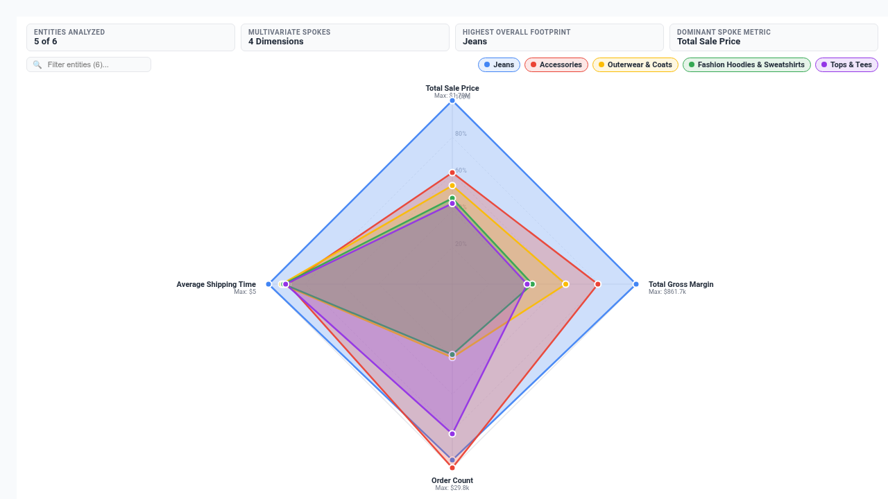

### 5. Sparkline Metric Matrix Table
Multi-metric scorecard featuring inline SVG sparklines, volume micro-bars, variance badges, and sticky summary totals.
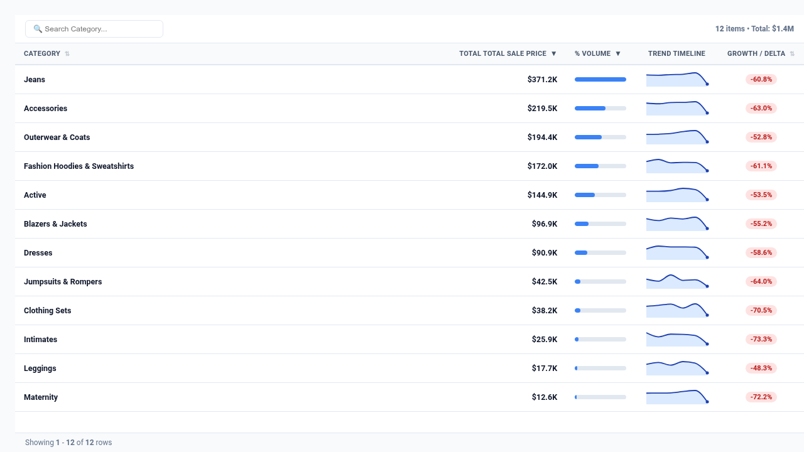

### 6. Rank Bump & Trajectory Chart
Temporal rank trajectory bump chart tracking entity position volatility, top gainers/fallers, and rank badge indicators.
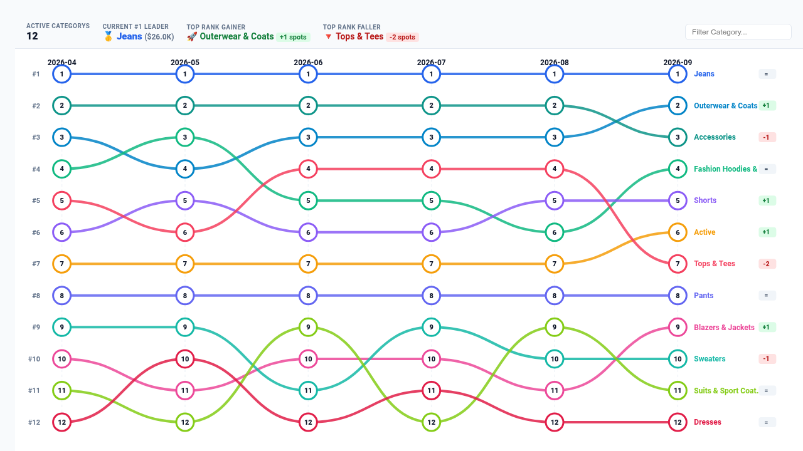

### 7. Collapsible Hierarchical Tree Grid
Consolidates multi-level parent-child hierarchies into a single indented tree column with interactive branch expansion, dynamic subtotal rollups, in-cell share progress bars, and branch search.
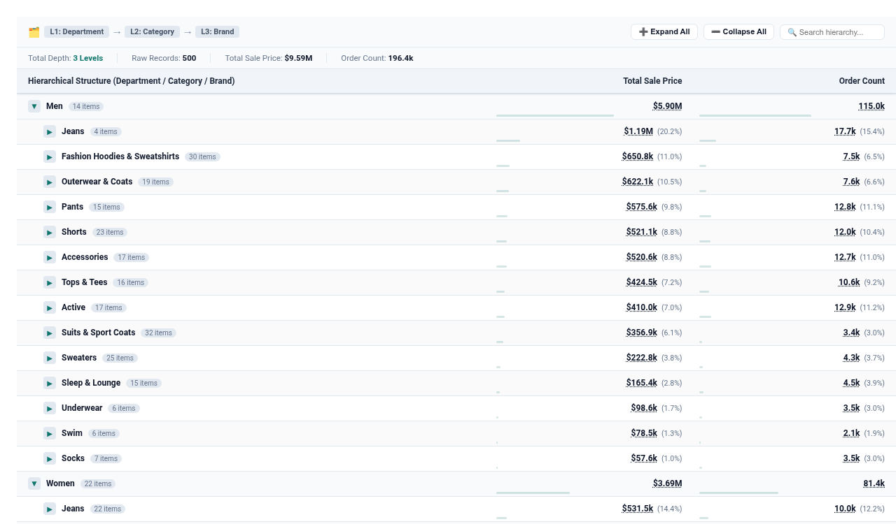

### 8. Dynamic Pivot Matrix & Heatmap Grid
Interactive pivot matrix with quantile cell color grading, row/column marginal totals, and compact value formatting.
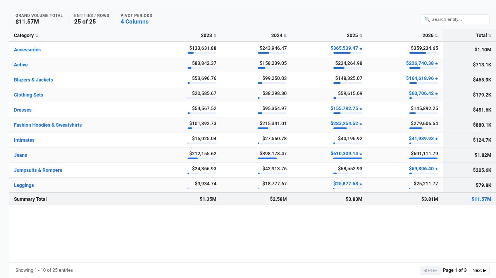

### 9. Sankey Flow & Multi-Stage Allocation Diagram
Multi-stage flow ribbons with gradient color transitions, animated traffic particles, and hover flow path isolation.
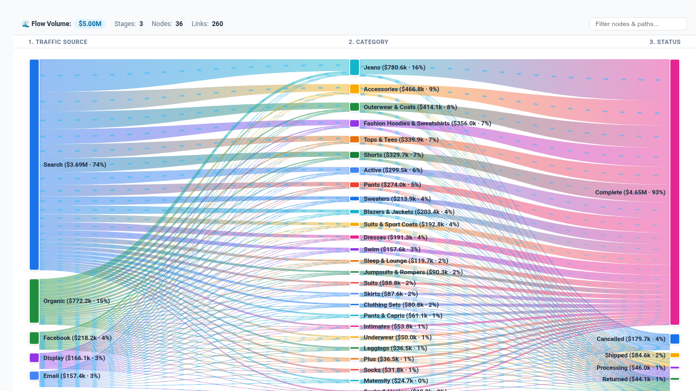

### 10. Interactive Hierarchical Drilldown Treemap
Enterprise hierarchical drilldown treemap with smooth zoom animations, interactive breadcrumb navigation (`🏠 All Categories > Men > Jeans`), dual-metric color gradients, dynamic Top-N & Others tail bucketing, real-time search filtering, and executive KPI HUD.
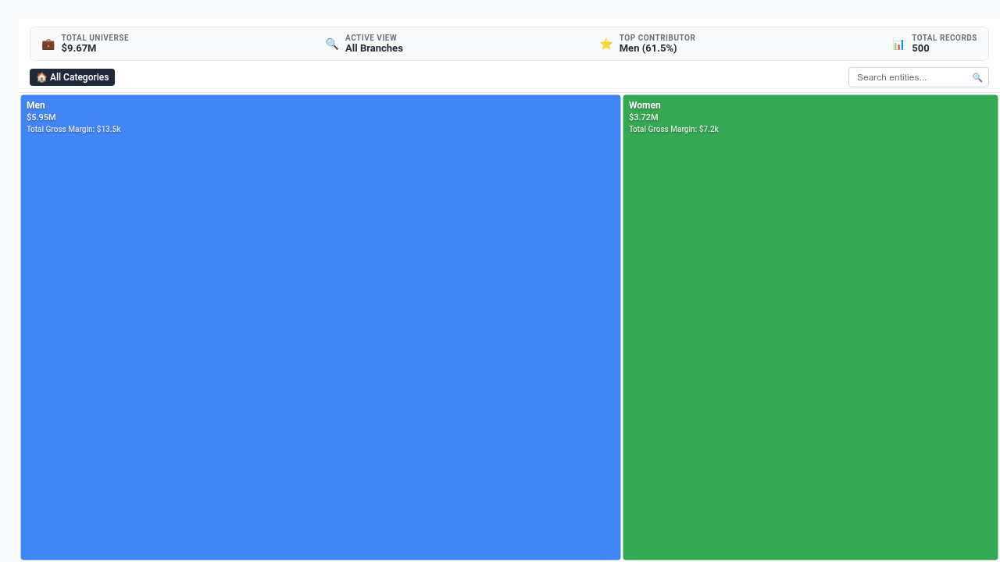

### 11. Sunburst Multi-Level Partition Wheel
Radial hierarchical partition wheel visualizing multi-level nested shares with center breadcrumb readout and drill zoom.
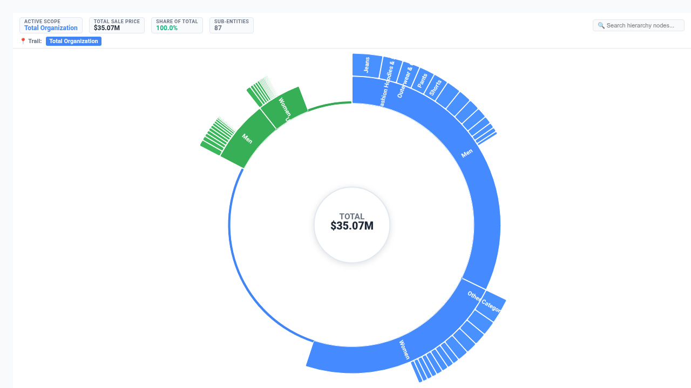

### 12. Interactive US Choropleth Map
Albers USA projected state-level choropleth map with quantile color breaks, gradient legend, and zoom controls.

### 13. Geospatial Flow & Route Arc Map
Origin-to-destination curved quadratic Bézier arcs over US TopoJSON geometry with animated particle pulses and hub selection.
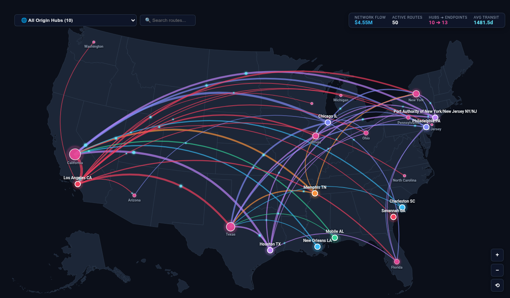

### 14. Dual-Axis Multi-Layer Geospatial Map
Synchronized dual-axis geospatial intelligence with Layer 1 choropleth polygon fill (volume/revenue) and Layer 2 proportional centroid bubble pins (margin/orders), dual legends, and hex cartogram mode.
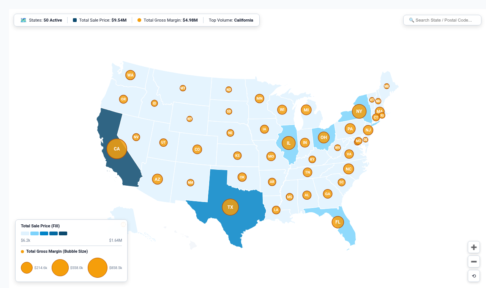

### 15. Geospatial Hexbin & Density Heatmap
Enterprise geospatial hexagonal tessellation and continuous Gaussian density heatmap custom visualization built with D3.js v7 and TopoJSON. Features 4 layout modes, mathematical $O(N)$ axial/cube coordinate tessellation, and 5,000+ row coordinates.
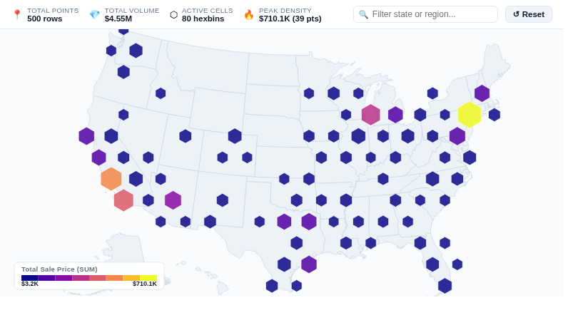

### 16. Interactive World & Regional Choropleth Map
Natural Earth world atlas choropleth supporting ISO2, ISO3, country names, and numeric country codes with auto-fitting zoom.
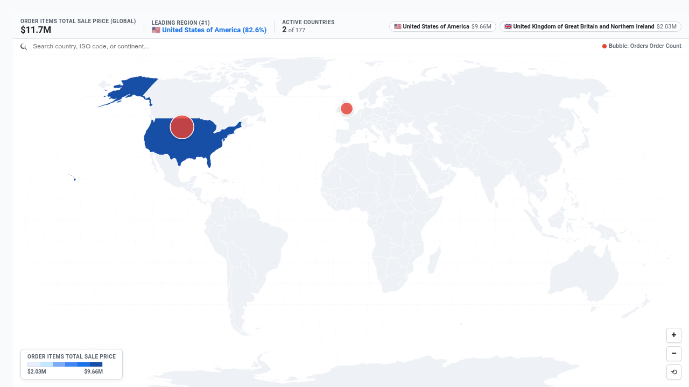

### 17. Calendar Activity Heatmap
53-week rolling GitHub-style calendar contribution grid with month/day labels, quantile intensity binning, target benchmarking, and peak volume detection.

### 18. Interactive Streamgraph & ThemeRiver Volume Flow
Multi-modal organic time-series streamgraph with ThemeRiver silhouette, Byron-Wattenberg organic wiggle, zero-pinned stacked area, and 100% normalized proportional share ribbon.
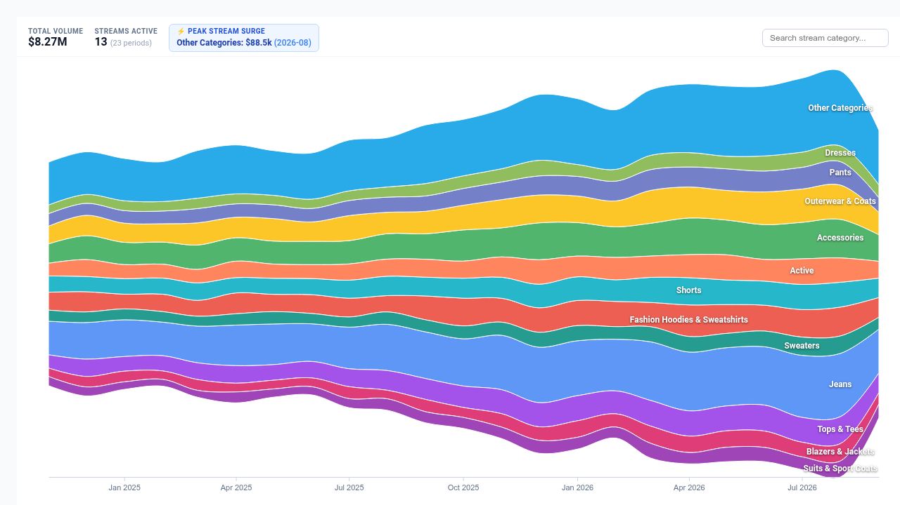

### 19. Executive Gantt & Milestones Schedule Timeline
High-density enterprise Executive Gantt and milestone roadmap schedule with progress bars, milestone pins, swimlanes, sticky time axis, and live search filtering.
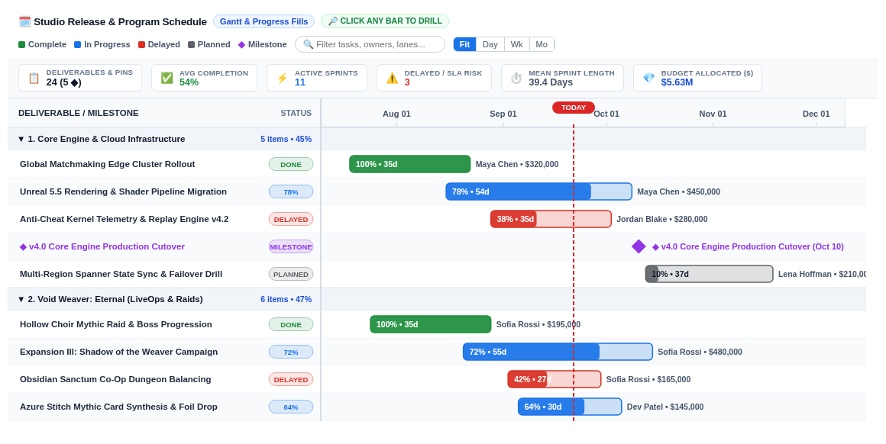

---

## 🔬 Volume 2: Industry Verticals, Telemetry & Advanced Data Apps

### 20. Player & Customer Retention Cohort Decay Matrix
Multi-cohort decay curves with benchmark average line synchronized above a triangular retention percentage heatmap.
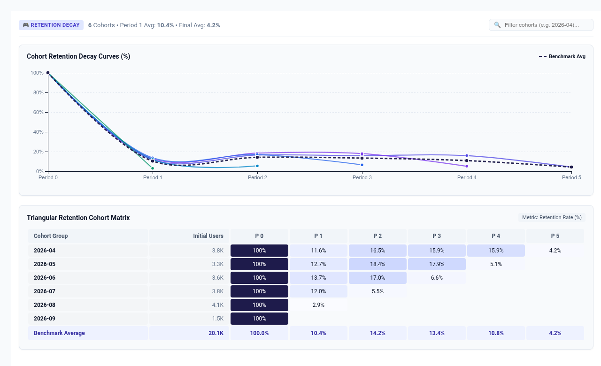

### 21. Telemetry & Conversion Funnel
Curved pipeline stages, drop-off step-to-step variance badges, multi-segment stacking, and executive summary HUD.
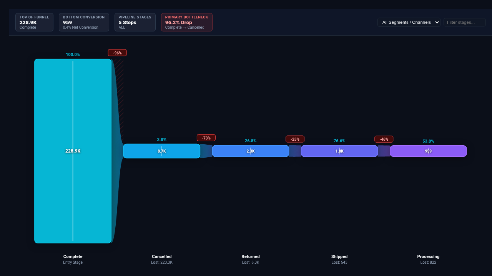

### 22. Level Progression & Difficulty Balancing Curve
Multi-modal game progression, difficulty pacing, and step-hazard attrition curve visualizer with choke-point anomaly detection ($Z > 1.5\sigma$), power-law baseline decay, and Executive Telemetry HUD.
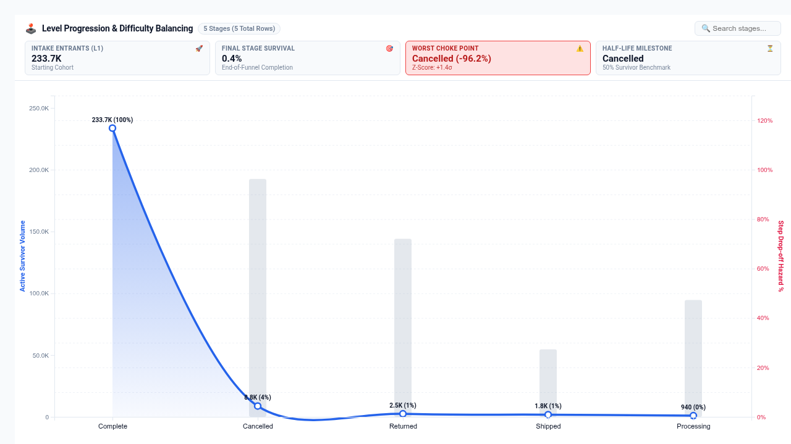

### 23. Matchmaking Latency & MMR Distribution Analyzer
Enterprise-grade matchmaking latency and player skill (MMR/Elo) distribution analyzer featuring skill bell curves, queue wait-time envelopes, rank tier cutoffs (Bronze through Grandmaster), and SLA threshold alerts.
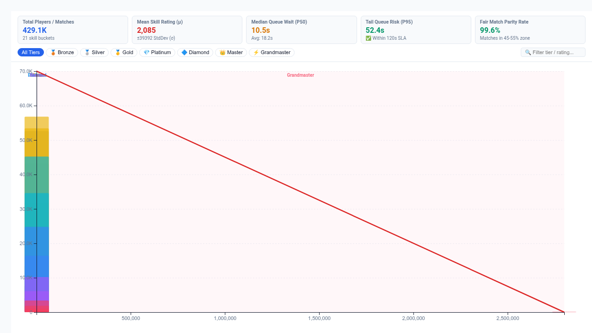

### 24. Game Economy Faucet & Sink Analyzer
Bilateral flow analyzer tracking virtual currency creation (faucets) against consumption and burns (sinks), net inflation/deflation balance, and transaction velocity.
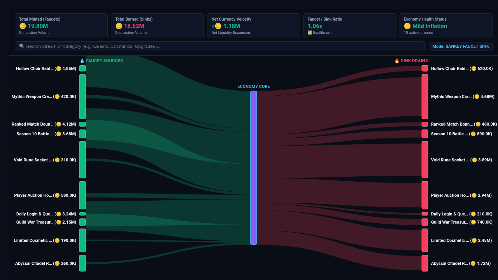

### 25. Broadcast Programming Schedule & Daypart Performance Grid
Nielsen standard daypart broadcast grid with 24-hour heat mapping, marginal day/hour totals, and peak rating indicators.
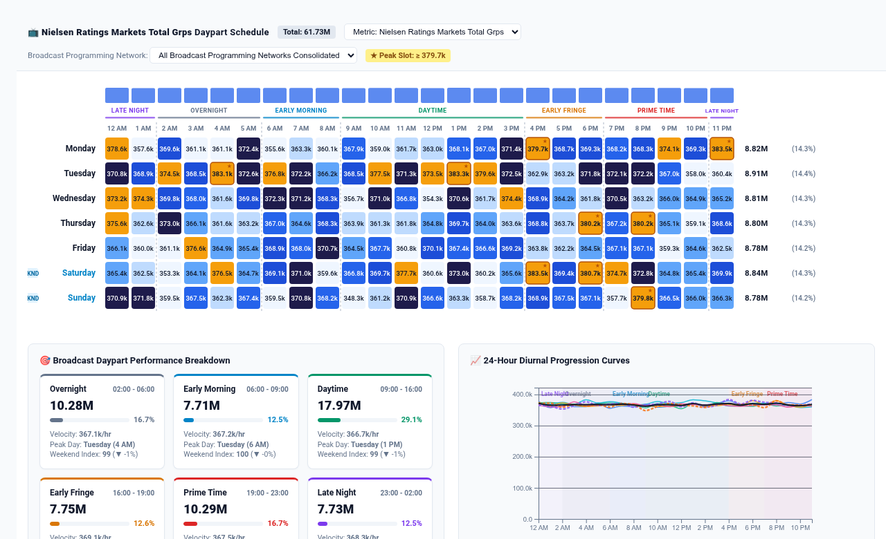

### 26. Ad Reach & Frequency Response Curve
Enterprise-grade Ad Reach & Frequency Response Curve, Effective Frequency Corridor (3x–6x sweet spot vs Ad Blindness and Ad Fatigue), and Marginal Response Diminishing Return Hill Curve.
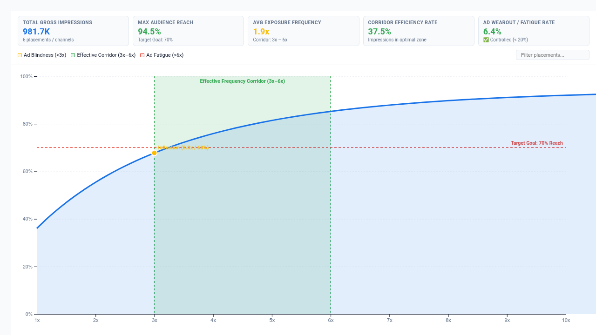

### 27. Network Topology & Latency Flow Graph
Force-directed topological mesh with collision simulation, latency threshold bottleneck detection, and edge packet animation.
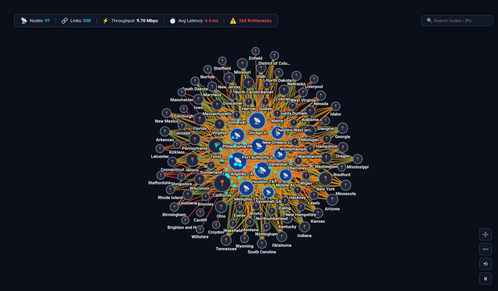

### 28. MITRE ATT&CK Threat Matrix & SecOps Kill-Chain Heatmap
Cybersecurity threat matrix mapping enterprise security alerts across MITRE ATT&CK tactics, techniques, MTTR response times, and kill-chain severities.
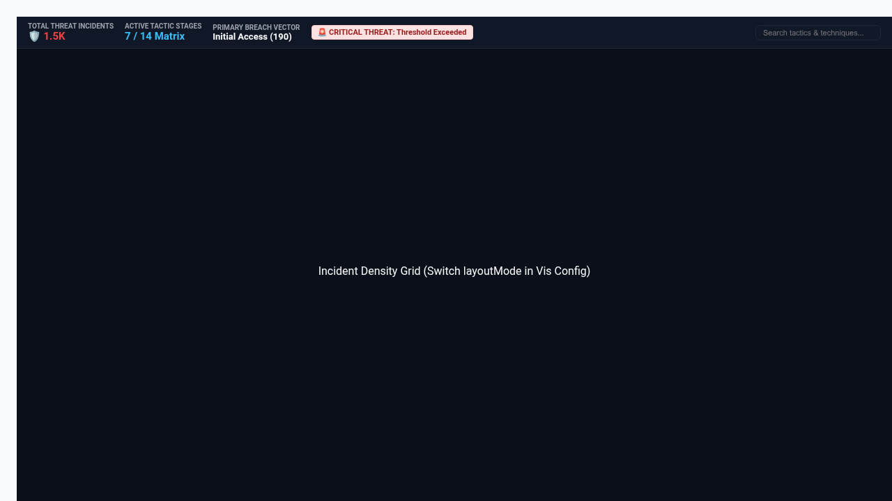

### 29. Violin & Box Plot Distribution Analyzer
High-performance statistical distribution analyzer computing non-parametric Kernel Density Estimation (KDE), Epanechnikov smoothing, five-number summary, Tukey whiskers, and outlier scatter directly client-side across 5,000+ rows.
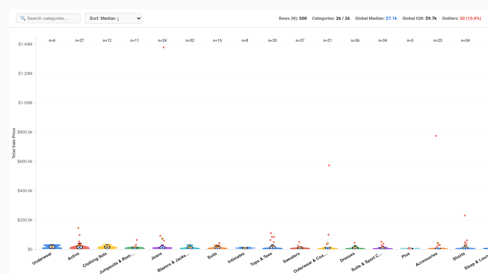

### 30. Forecast & Confidence Cone (Fan Chart)
Predictive time-series fan chart combining historical actual observations with forward BigQuery `AI.FORECAST` projections, shaded 90% confidence uncertainty cones, What-If simulation slider (-50% to +50%), and Executive Pipeline HUD.
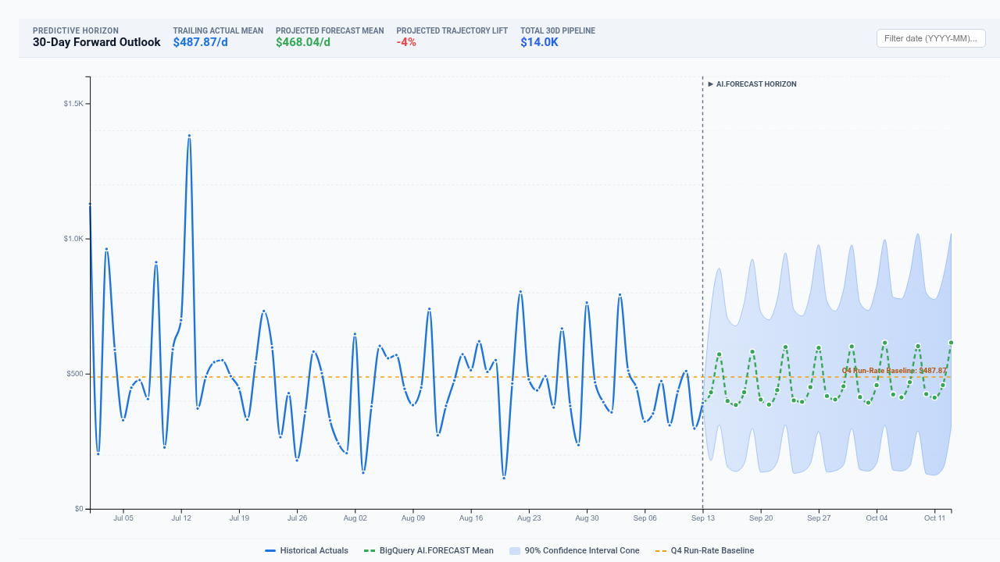

### 31. Bilateral Chord Diagram & Directed Flow Matrix
Interactive bilateral chord diagram and relational flow matrix with 3 layout modes (Circular Directed Chord, Bilateral Flow Matrix Heatmap, and Bipartite Split Corridor), directional ribbon gradients, and Looker drill menus.
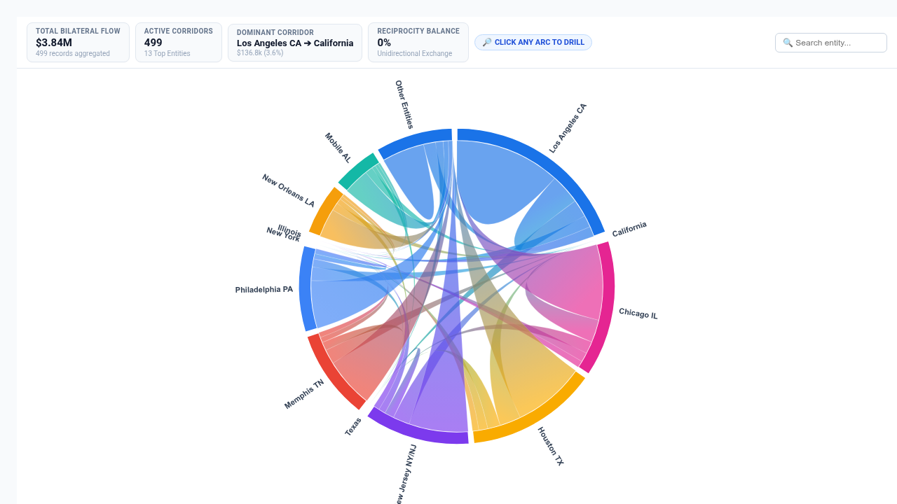

### 32. Pareto 80/20 & ABC Stratification Analyzer
Enterprise-grade Pareto 80/20 analysis and ABC inventory/defect stratification analyzer featuring dual Y-axis ogive curve, ABC Stratification Matrix, Lorenz Inequality Curve & Gini index, and Cumulative Stepped Waterfall.
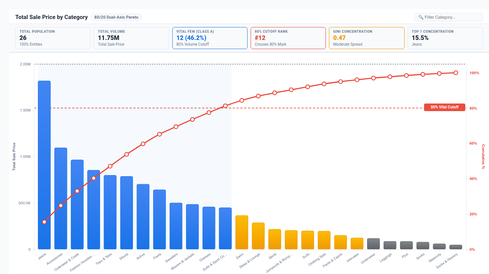
