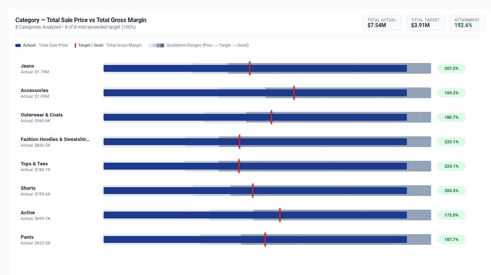

# Stephen Few Bullet Graph



An enterprise implementation of Stephen Few's classic **Bullet Graph** specification for Google Cloud Looker, engineered with **D3.js v7**.

Bullet graphs were designed by visualization pioneer Stephen Few as an information-dense, high-efficiency replacement for dashboard gauges and meters. This visualization displays actual metric performance against qualitative benchmark ranges (e.g. Poor, Satisfactory, Good, Stretch) and distinct target / quota markers, complete with dynamic variance badges, executive KPI scorecard HUDs, and Looker drill menus.

---

## 📸 Key Features

- **Multi-Category Executive Layout**: Displays clean, comparative bullet graphs across all categories in your dataset.
- **Horizontal & Vertical Orientation**: Toggle between standard horizontal rows or columnar vertical cards.
- **Dynamic Field-Role Mapping**: Custom 1-based index or field name overrides for Dimension, Actual Measure, Target Measure, and Baseline Measure without re-ordering Looker Explore queries.
- **7 Target & Quota Calculation Modes**:
  - `Measure Column (From Query)`
  - `Percentage Multiplier of Actual (e.g. 115%)`
  - `Fixed Static Target Value`
  - `Dataset Mean (100% = Group Average)`
  - `Dataset Median (100% = Group Median)`
  - `Top Percentile P75 Target`
  - `Top Percentile P90 Target`
- **Qualitative Performance Bands**: Configurable 3-tier (Poor / Satisfactory / Good) or 4-tier (Poor / Fair / Good / Stretch) background ranges with customizable percentages.
- **Sorting & Top-N Rollups**: Interactive sorting (Actual Descending/Ascending, Attainment % Descending/Ascending, Alphabetical), Top-N category limiter (0–25), and optional `'Other'` rollup bar.
- **Executive KPI Scorecard HUD**: Top banner with Scorecard Mode, Compact Strip, or Hidden, displaying overall group attainment %, total volume, and status pills.
- **Interactive Search & Value Readouts**: Real-time category search filter bar and configurable data readouts (All, Min/Max Peaks Only, Hidden).
- **Brand Palettes & Custom Hex Overrides**:
  - `Executive Slate` (Classic Few neutral slate with Navy actual bar & Crimson target)
  - `Google Enterprise` (Google Blue, Red, Yellow, Green palette)
  - `Modern Slate` (High-contrast slate & rose)
  - `Cyberpunk Dark` (Dark mode theme with neon sky blue & rose indicators)
  - `Emerald FinOps` (Deep greens & forest tones for sustainability and margin)
  - `Sunset Media` (Warm amber, coral, and terracotta hues)
  - `Wellverse Healthcare` (Navy, teal, and slate medical theme)
  - `Custom Hex Override` (Dedicated color pickers for Actual, Target, and Alert colors)
- **Metric Polarity**: Toggle between `Higher is Better` (Revenue, Margin) and `Lower is Better` (Latency, Churn, Defect, Operating Cost).
- **Interactive Tooltip & Native Drill Menus**: Rich hover card with variance breakdown and one-click integration with Looker's native `LookerCharts.Utils.openDrillMenu`.

---

## 📊 Data Shape Requirements

| Field Type | Count | Purpose | Examples |
| :--- | :--- | :--- | :--- |
| **Dimension** | `0` or `1` | Category / Item grouping | `products.category`, `users.state`, `sales_reps.name` |
| **Measure 1** | `1` *(Required)* | **Actual Performance Value** | `order_items.total_sale_price`, `sales.revenue` |
| **Measure 2** | `0` or `1` *(Optional)* | **Target / Quota / Goal Value** | `sales_goals.quota_amount`, `order_items.total_gross_margin` |
| **Measure 3** | `0` or `1` *(Optional)* | **Comparative Baseline Value** | `sales.prior_year_revenue` |

> 💡 **No 2nd measure?** You can configure target values via the visualization settings (e.g., automated 1.15x multiplier, dataset mean/median, or fixed static targets).

---

## ⚙️ Configuration Options (Strict 2-Tab Layout)

### Tab 1: Display
| Option | Type | Default | Description |
| :--- | :--- | :--- | :--- |
| `orientation` | Select | `Horizontal` | Horizontal row layout or Vertical columnar layout |
| `dimFieldOverride` | String | `1` | 1-based column index or field name for Category Dimension |
| `measureFieldOverride` | String | `1` | 1-based column index or field name for Actual Performance Measure |
| `targetMeasureOverride` | String | `2` | Optional 1-based column index or field name for Target Measure |
| `baselineMeasureOverride` | String | `3` | Optional 1-based column index or field name for Baseline Measure |
| `targetCalculationMode` | Select | `second_measure` | Target source (Measure Column, Multiplier, Fixed, Mean, Median, P75, P90) |
| `targetMultiplier` | Number | `1.15` | Multiplier when source is Multiplier |
| `fixedTargetValue` | Number | `0` | Target value when source is Fixed |
| `referenceLineLabel` | String | `Target Goal` | Custom label for target/quota marker |
| `anomalyThresholdPct` | Number | `120` | Attainment percentage threshold for high-performance anomaly alert |
| `qualitativeRanges` | Select | `3_tier` | Qualitative Range Tiers (3-Tier or 4-Tier) |
| `band1Pct`–`band4Pct` | Number | `60, 85, 100, 120` | Percent threshold anchors for range bands |
| `sortBy` | Select | `default` | Sort items by Actuals, Attainment %, or Category Name |
| `topNLimit` | Number | `0` | Limit display to Top N categories (0 = All) |
| `enableOtherRollup` | Boolean | `false` | Roll up categories beyond Top-N into single "Other" bar |
| `suppressZeroNull` | Boolean | `false` | Filter out categories with zero or null actuals |
| `hudMode` | Select | `scorecard` | Executive Scorecard HUD (Full Scorecard, Compact Strip, Hidden) |
| `showValueLabels` | Select | `all` | Show readouts for All categories, Peaks Only, or Hidden |
| `customTitleOverride` | String | `""` | Override scorecard header title |
| `showSearch` | Boolean | `true` | Show real-time category search bar |
| `showTargetMarker` | Boolean | `true` | Show target quota line |
| `showVarianceBadge` | Boolean | `true` | Show attainment % / variance delta badge |
| `varianceBadgeFormat` | Select | `attainment_pct` | Display Attainment % (`108%`), Variance % (`+8%`), or Delta Value (`+$12K`) |

### Tab 2: Style
| Option | Type | Default | Description |
| :--- | :--- | :--- | :--- |
| `colorTheme` | Select | `executive_slate` | Theme palette preset (Slate, Google Enterprise, Modern Slate, Cyberpunk, Emerald, Sunset, Wellverse, Custom) |
| `customPrimaryHex` | Color | `""` | Custom hex color for actual performance bar |
| `customPositiveHex` | Color | `""` | Custom hex color for target/success marker |
| `customNegativeHex` | Color | `""` | Custom hex color for alert/deficit badge |
| `metricPolarity` | Select | `higher_is_better` | Higher is Better (Revenue) vs Lower is Better (Latency/Defects) |
| `fontScale` | Select | `standard` | Typography scale (Compact, Standard, Large Presentation) |
| `valueFormat` | Select | `compact_currency` | Formatting (Auto, Compact Currency, Compact Number, Percentage, Decimal, Raw) |
| `barThickness` | Range | `18` | Thickness of actual bar in pixels |
| `rowHeight` | Range | `64` | Row height in pixels |
| `enableAnimation` | Boolean | `true` | Smooth D3 entry animations |

---

## 🚀 Manifest Snippet (`manifest.lkml`)

```lookml
visualization: {
  id: "bullet_graph"
  label: "Stephen Few Bullet Graph"
  file: "visualizations/bullet_graph.js"
  dependencies: ["https://d3js.org/d3.v7.min.js"]
}
```
