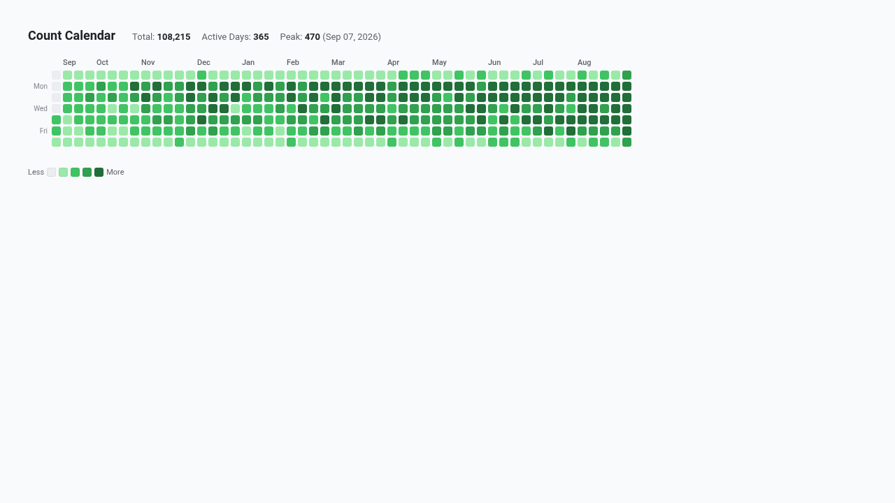

# Calendar Activity Heatmap



A custom Looker visualization built with D3.js v7 that renders an interactive, GitHub-style contribution and daily activity grid across rolling calendar dates.

Upgraded with **Multi-Modal Enterprise Flexibility**:
- **Dynamic Field-Role Mapping (`Display`)**: Remap Date dimension, primary measure, and optional target/goal measure by 1-based index or field name.
- **Configurable Reference Lines & Targets (`Display`)**: Select between Dataset Mean, Dataset Median, Percentiles (P75/P90), Fixed Value, or dedicated Measure Column, with custom baseline label and anomaly spike threshold detection.
- **Executive KPI Scorecard HUD (`Display`)**: Top metric strip highlighting total volume, active days, goal attainment percentage, and all-time peak day.
- **Interactive Search & Hotspot Highlighting (`Display`)**: Filter dates dynamically via search bar; automatically pins peak volume days.
- **Brand Palettes & Value Formatting (`Style`)**: Choose from GitHub Classic, Google Enterprise, Modern Slate, Electric Blue, Cyberpunk Dark, Emerald FinOps, Sunset Media, Wellverse Healthcare, or custom hex overrides; support for metric polarity (higher vs lower is better) and compact number/currency formatting.
- **Looker Drill Menus**: Full drill-down integration (`LookerCharts.Utils.openDrillMenu`) on hover/click across all active days.

## Recommended Data Shapes
- **Dimension 1**: A Date field (e.g. `order_items.created_date`, `events.event_date`, `mart_daily_kpis.activity_date`) formatted as `YYYY-MM-DD`.
- **Measure 1**: Any count or sum measure (e.g. `order_items.count`, `order_items.total_sale_price`).
- **Measure 2 (Optional)**: Daily target or goal measure.
- **Filter**: Filter by a relevant timeframe, such as `last 365 days` or `last 90 days`.

## Setup in Looker (`manifest.lkml`)
```lookml
visualization: {
  id: "calendar_activity_heatmap"
  label: "Calendar Activity Heatmap"
  file: "visualizations/calendar_activity_heatmap.js"
  dependencies: ["https://d3js.org/d3.v7.min.js"]
}
```
