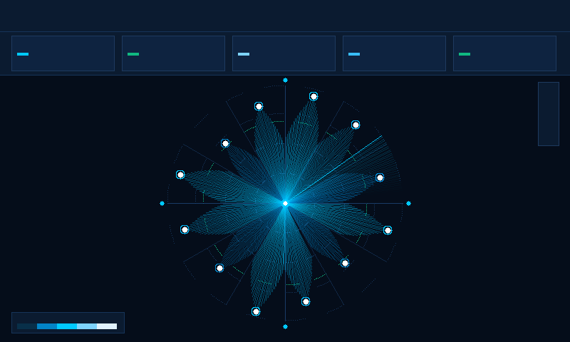

# Cell Tower Sector Azimuth & RF Polar Map



An executive **Cell Tower Sector Azimuth & RF Signal Coverage Polar Map** custom visualization for Google Cloud Looker, engineered with **D3.js v7**.

Specifically designed for Telecommunications, 5G RAN Network Operations (Nokia AirScale, Ericsson, Samsung), Cloud Infrastructure, and SecOps teams, this visualization solves a fundamental industry visualization gap: **representing directional antenna azimuth orientations (0° to 360° compass bearings) and radial radio-frequency (RF) signal propagation distance on a native polar coordinate system**.

---

## 📸 Key Features

- **Multi-Modal Polar Paradigms (`Display`)**:
  - `Omni 360° Radar Sectors (Radiation Lobes)`: Smooth directional antenna radiation lobes radiating from the center outward, showing beamwidth spread, sector orientations (Sector Alpha 0° North, Beta 120° SE, Gamma 240° SW), and signal reach.
  - `Polar Constellation & Scatter Pins`: Coordinate mapping where angle $\theta$ represents azimuth compass bearing (0°–360°) and radius $r$ represents throughput / transmission distance, with secondary metric sizing and peak site halos.
  - `Azimuth Sector Heat Grid`: 12 Compass sectors $\times 4$ concentric radial distance tiers (48 polar bins) for high-density spatial RF signal distribution.
- **Dynamic Field-Role Mapping (`Display`)**: Remap site dimension, azimuth angle dimension, primary RF metric, and secondary latency/load metric by 1-based column index or field name without modifying Looker Explore column ordering.
- **5G SLA Benchmark Rings & Anomaly Alerts (`Display`)**:
  - Concentric dashed SLA benchmark ring rendered at customizable targets (`fixed` e.g. 500 Mbps, `dataset_mean`, `percentile_p75`, `percentile_p90`, or `second_measure`).
  - Automated anomaly alerts when a sector's variance drops below SLA goal beyond the threshold percentage.
- **Executive Scorecard HUD & Search (`Display`)**: Full Scorecard HUD displaying active 5G sites, peak sector throughput, network mean latency, and 5G SLA compliance percentage. Live client-side site search filter.
- **Interactive Pan & Zoom Navigation**: SVG zoom container with on-screen Zoom In (`+`), Zoom Out (`−`), and Reset (`↺`) controls.
- **Animated 360° Radar Sweep Line (`Display`)**: Continuous rotating beam sweep line simulating active cellular base station radar telemetry.
- **Signature Telecom Brand Palettes (`Style`)**:
  - `Nokia 5G Cyan / Deep Navy` (Signature Nokia AirScale dark theme: `#050d1a`, `#0064d2`, `#00c9ff`, `#ffffff`)
  - `Google Enterprise` (Google Slate, Blue, Green, Red)
  - `Cyberpunk Radar` (Midnight slate with neon cyan and pink)
  - `Modern Slate`
  - `Emerald FinOps`
  - `Sunset Amber`
  - `Wellverse Healthcare`
  - `Thermal RF Heat`
  - `Custom Hex Override` (Direct hex pickers)
- **Metric Polarity (`Style`)**: Toggle `Higher is Better` (Throughput, Coverage) vs `Lower is Better` (Latency, Packet Loss, Alarms).
- **One-Click Looker Drill Links**: Click any radiation lobe, scatter pin, or heat tile to open Looker's native drill-down menu.

---

## 📊 Data Shape Requirements

| Field Type | Required Count | Purpose | Example (`nokia_network_ops::network_operations`) |
| :--- | :--- | :--- | :--- |
| **Dimension 1** | `1` *(Required)* | Cell Site Name or Tower ID | `cell_towers.site_name` |
| **Dimension 2** | `0` or `1` *(Optional)* | Azimuth Compass Bearing (0°–360°) | Auto-distributed around compass if omitted |
| **Measure 1** | `1` *(Required)* | Primary RF Metric (Throughput / Distance) | `network_kpi_telemetry.avg_throughput_mbps` |
| **Measure 2** | `0` or `1` *(Optional)* | Secondary Metric (Latency / Loss / Load) | `network_kpi_telemetry.avg_latency_ms` |

---

## ⚙️ Configuration Options (Strictly 2 Sections)

### Section: `Display`
- `polarMode`: Polar Visual Paradigm Mode (`omni_radar`, `polar_scatter`, `azimuth_heatmap`)
- `siteFieldOverride`: Site Dimension Index or Name (1 = Col 1)
- `sectorAngleOverride`: Azimuth Angle / Bearing Dimension (or Auto Compass)
- `primaryMeasureOverride`: Primary RF Measure (1 = Col 1)
- `secondaryMeasureOverride`: Secondary Measure (2 = Col 2)
- `targetCalculationMode`: 5G SLA Target Benchmark Mode (`none`, `second_measure`, `fixed`, `dataset_mean`, `dataset_median`, `percentile_p75`, `percentile_p90`)
- `fixedTargetValue`: Fixed SLA Target Value (default: `500`)
- `referenceLineLabel`: Benchmark SLA Target Label (default: `"5G SLA Target (500 Mbps)"`)
- `showReferenceLine`: Show Concentric Benchmark SLA Target Ring
- `anomalyThresholdPct`: RF Deviation Anomaly Alert Threshold % (default: `35`)
- `sortBy`: Sort Sector Sites By (`none`, `metric_desc`, `metric_asc`, `azimuth_asc`, `site_asc`)
- `topNLimit`: Top-N Sites Limit (0 = All, Max 60)
- `enableOtherRollup`: Group Remaining into Other Rollup Sector
- `suppressZeroNull`: Suppress Zero / Null Telemetry Sites
- `hudMode`: Executive Scorecard HUD Mode (`scorecard`, `compact_strip`, `none`)
- `labelDensity`: Compass & Sector Label Density (`all`, `cardinal`, `none`)
- `customTitle`: Custom Map Title Override
- `customSubtitle`: Custom Subtitle / Description Override
- `showSearch`: Show Interactive Cell Site Search Bar
- `showLegend`: Show Concentric Range Ring Legend
- `beamSweepAnimation`: Enable Animated 360° Radar Sweep Line
- `enableZoom`: Enable Pan & Zoom Navigation

### Section: `Style`
- `colorTheme`: Brand Palette Preset (`nokia_cyan`, `google_blue`, `cyberpunk_dark`, `modern_slate`, `emerald_finops`, `sunset_media`, `wellverse_healthcare`, `thermal_heat`, `custom`)
- `customPrimaryColor`: Custom Primary Beam / Scale Hex
- `customPositiveColor`: Custom Positive / Compliant Hex
- `customNegativeColor`: Custom Alert / Non-Compliant Hex
- `metricPolarity`: Metric Polarity (`higher_better`, `lower_better`)
- `fontScale`: Typography & Font Scaling (`compact`, `standard`, `large`)
- `valueFormat`: Metric Display Format (`auto`, `compact_number`, `compact_currency`, `percentage`, `decimal_2`, `raw`)
- `radarRingCount`: Concentric Polar Range Rings Count (default: `4`)
- `highlightColor`: Hover Highlight Stroke Color (default: `#00c9ff`)

---

## 🚀 Manifest Snippet (`manifest.lkml`)

```lookml
visualization: {
  id: "cell_tower_polar_coverage"
  label: "Cell Tower Sector Azimuth & RF Polar Map"
  file: "visualizations/cell_tower_polar_coverage.js"
  dependencies: [
    "https://d3js.org/d3.v7.min.js"
  ]
}
```
