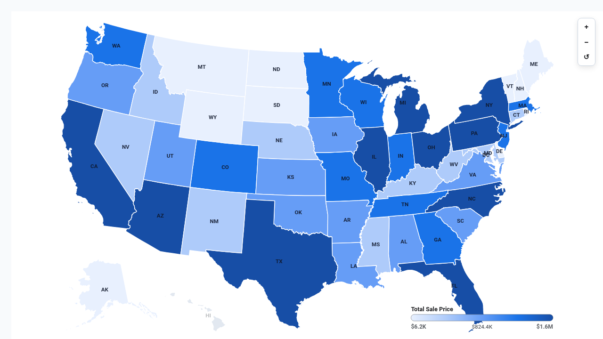

# Interactive US Choropleth Map



An interactive, pure SVG **US State Choropleth Map** custom visualization for Google Cloud Looker, engineered with **D3.js v7** and **TopoJSON Client**.

Unlike native maps that require Google Maps API keys or third-party mapping subscriptions, this visualization renders directly as responsive SVG using official US Census TopoJSON boundaries. It supports quantile, linear, and quantize color scaling, interactive state hover cards, postal abbreviation labels, and Looker drill-down links.

---

## 📸 Key Features

- **Multi-Modal Display Options (`Display`)**:
  - `Choropleth Filled Polygons`: Classic continuous/quantile polygon shading.
  - `Proportional Bubble Pins`: Proportional circles scaled at state centroids using `d3.scaleSqrt()`, ideal for transaction frequency and volume pins.
  - `Hybrid Overlay`: Dual-layer visualization combining choropleth polygon fills with proportional bubble pin overlays.
- **Dynamic Field-Role Mapping (`Display`)**: Remap state dimension, primary metric measure, and secondary/comparison measure by 1-based column index or field name without modifying Looker Explore column ordering.
- **Configurable Reference Benchmarks & Targets (`Display`)**:
  - `none`: Standard absolute map without target benchmarking.
  - `second_measure`: Direct comparison against secondary query measure.
  - `multiplier`: Percentage multiplier of baseline (e.g. 115%).
  - `fixed`: Static benchmark target across all territories.
  - `dataset_mean` & `dataset_median`: Automated group statistical benchmarks.
  - `percentile_p75` & `percentile_p90`: Top-tier statistical targets.
- **Anomaly Alerts & Variance Badges (`Display`)**: Anomaly alert flags when state variance deviates beyond a customizable threshold percentage (e.g. ±30%).
- **Interactive Sorting & Top-N Bucketing (`Display`)**: Sort by metric descending/ascending, state name, or variance vs target. Limit to Top-N with optional `"Other"` rollup summary.
- **Executive Scorecard HUD & Search (`Display`)**: Full Scorecard HUD with total territories, aggregate volume, mean per state, top gainer state, and benchmark variance. Live client-side state search filtering.
- **5,000+ Row High-Density Dataset Support**: Client-side high-density aggregation sums, averages, counts, and finds peaks across thousands of rows without requiring manual SQL pre-aggregation.
- **Interactive Pan & Zoom**: Smooth SVG navigation with floating Zoom In (`+`), Zoom Out (`−`), and Reset (`↺`) controls.
- **Enterprise Brand Palettes & Custom Hex Overrides (`Style`)**:
  - `Google Enterprise` (Light ice blue to deep navy)
  - `Executive Slate` (Classic Few grayscale to slate)
  - `Modern Slate`
  - `Cyberpunk Dark` (Dark mode slate with neon cyan)
  - `Emerald FinOps` (Mint to emerald)
  - `Sunset Media` (Warm amber to terracotta)
  - `Wellverse Healthcare` (Navy to health blue)
  - `Thermal Heat` (Yellow-Orange-Red heat scale)
  - `Custom Hex Override` (Direct hex color pickers for primary, positive, and negative)
- **Metric Polarity (`Style`)**: Toggle `Higher is Better` (Revenue, Output) vs `Lower is Better` (Cost, Latency, Churn).
- **One-Click Looker Drill Links**: Click any state polygon or bubble pin to trigger Looker's native drill-down overlay.

---

## 📊 Data Shape Requirements

| Field Type | Required Count | Purpose | Example (`order_items`) |
| :--- | :--- | :--- | :--- |
| **Dimension** | `1` *(Required)* | State Name or 2-letter Postal Code | `users.state` |
| **Measure 1** | `1` *(Required)* | Primary Numeric Metric | `order_items.total_sale_price`, `users.count` |
| **Measure 2** | `0` or `1` *(Optional)* | Secondary Comparison / Target Metric | `order_items.total_gross_margin` |

---

## ⚙️ Configuration Options (Strictly 2 Sections)

### Section: `Display`
- `mapMode`: Map Display Mode (`choropleth`, `bubble_pins`, `both_hybrid`)
- `stateFieldOverride`: State Dimension Index or Name (1 = Col 1)
- `measureFieldOverride`: Primary Metric Measure Index or Name (1 = Col 1)
- `secondaryMeasureOverride`: Secondary / Target Measure Index or Name (2 = Col 2)
- `targetCalculationMode`: Target / Benchmark Mode (`none`, `second_measure`, `multiplier`, `fixed`, `dataset_mean`, `dataset_median`, `percentile_p75`, `percentile_p90`)
- `targetMultiplier`: Target Multiplier when Mode is Multiplier (default: `1.15`)
- `fixedTargetValue`: Fixed Benchmark Target Value (0 = Auto)
- `referenceLineLabel`: Benchmark Target Label (default: `"National Benchmark"`)
- `showReferenceLine`: Show Benchmark Target in HUD & Tooltips
- `anomalyThresholdPct`: Variance Anomaly Alert Threshold % (default: `30`)
- `sortBy`: Sort Territories By (`none`, `metric_desc`, `metric_asc`, `state_asc`, `variance_desc`)
- `topNLimit`: Top-N Territories Limit (0 = All, Max 50)
- `enableOtherRollup`: Group Remaining into Other Rollup Summary
- `suppressZeroNull`: Suppress Zero / Null Territories
- `aggregationType`: High-Density Aggregation Method (`sum`, `avg`, `count`, `max`)
- `hudMode`: Executive Scorecard HUD Mode (`scorecard`, `compact_strip`, `none`)
- `labelDensity`: State Postal Code Labels (`all`, `peaks`, `none`)
- `customTitle`: Custom Map Title Override
- `customSubtitle`: Custom Subtitle / Description Override
- `showSearch`: Show Interactive State Search Bar
- `showLegend`: Show Gradient Legend Bar
- `enableZoom`: Enable Pan & Zoom Navigation

### Section: `Style`
- `colorTheme`: Brand Palette Preset (`google_blue`, `executive_slate`, `modern_slate`, `cyberpunk_dark`, `emerald_finops`, `sunset_media`, `wellverse_healthcare`, `thermal_heat`, `custom`)
- `customPrimaryColor`: Custom Scale High / Primary Hex (when `colorTheme` is `custom`)
- `customPositiveColor`: Custom Positive / Goal Hex
- `customNegativeColor`: Custom Negative / Alert Hex
- `metricPolarity`: Metric Polarity (`higher_better`, `lower_better`)
- `fontScale`: Typography & Font Scaling (`compact`, `standard`, `large`)
- `valueFormat`: Metric Display Format (`auto`, `compact_currency`, `full_currency`, `compact_number`, `full_number`, `percent`, `decimal_2`, `raw`)
- `colorScaleMode`: Color Scale Distribution (`quantile`, `linear`, `quantize`)
- `nullColor`: No Data State Color (default: `#f1f5f9`)
- `highlightColor`: Hover Highlight Stroke Color (default: `#f59e0b`)

---

## 🚀 Manifest Snippet (`manifest.lkml`)

```lookml
visualization: {
  id: "choropleth_map"
  label: "Interactive US Choropleth Map"
  file: "visualizations/choropleth_map.js"
  dependencies: [
    "https://d3js.org/d3.v7.min.js",
    "https://cdn.jsdelivr.net/npm/topojson-client@3.1.0/dist/topojson-client.min.js"
  ]
}
```
