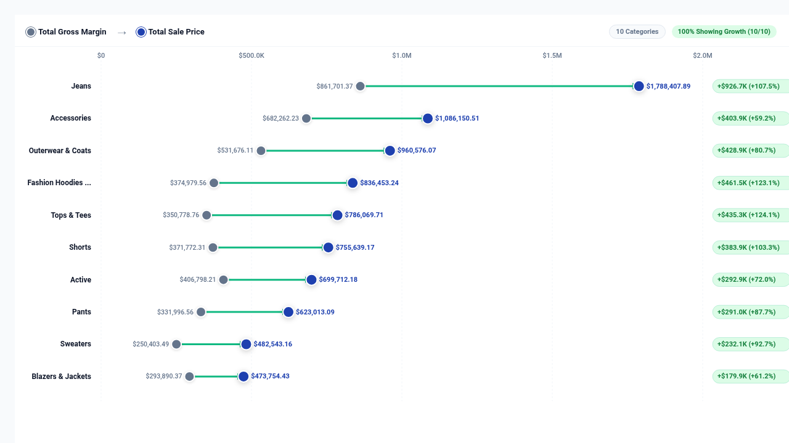

# Dumbbell Divergence Plot (Connected Dot Plot)



An executive **Dumbbell Divergence Plot** (also known as a **Connected Dot Plot** or **DNA Plot**) custom visualization for Google Cloud Looker, engineered with **D3.js v7**.

Dumbbell plots are championed by data visualization leaders (Stephen Few, Edward Tufte, Financial Times, and Storytelling with Data) as the cleanest, most space-efficient alternative to clustered bar charts when comparing two continuous values across categories. Instead of cluttering dashboards with grouped bars, each category is presented as a sleek horizontal barbell showing baseline (Start/Point A) and outcome (End/Point B) dots connected by a directional variance bridge.

---

## 📸 Key Features

- **Dynamic Field-Role Mapping (`Display`)**: Remap primary dimension, baseline measure Point A, and comparison measure Point B by 1-based column index or field name without modifying Looker Explore field ordering.
- **Configurable Target & Benchmark Modes (`Display`)**:
  - `second_measure`: Direct Point B comparison from query.
  - `multiplier`: Percentage multiplier of Baseline Point A (e.g. 115%).
  - `fixed`: Static benchmark target.
  - `dataset_mean` & `dataset_median`: Automated group statistical benchmarks.
  - `percentile_p75` & `percentile_p90`: Top-tier statistical targets.
- **Reference Line & Anomaly Alerts (`Display`)**: Optional vertical dashed reference line across the chart, with anomaly alert badges when variance exceeds customizable thresholds.
- **Interactive Sorting & Top-N Bucketing (`Display`)**: Sort by delta ascending/descending, Point A/B values, or alphabetical category names. Limit to Top-N with optional `"Other"` rollup barbell.
- **Executive KPI HUD & Search (`Display`)**: Full Scorecard HUD with net variance, growth percentage, top positive gainer, and total categories analyzed. Live client-side category search filtering.
- **Directional Variance Bridges & Chevrons (`Display`)**: Bridge lines dynamically color-code by variance direction (emerald green for positive growth, crimson red for decline) with directional arrowheads.
- **Enterprise Color Palettes & Custom Hex Overrides (`Style`)**:
  - `Executive Slate` (Classic Few)
  - `Google Enterprise`
  - `Modern Slate`
  - `Cyberpunk Dark`
  - `Emerald FinOps`
  - `Sunset Media`
  - `Wellverse Healthcare`
  - `Custom Hex Override` (direct hex pickers for Point A, Point B, Positive, and Negative)
- **Metric Polarity (`Style`)**: Toggle `Higher is Better` (Revenue, Margin) vs `Lower is Better` (Cost, Latency, Churn).
- **Responsive Layout & Drill Menus**: Debounced `<4px` ResizeObserver guard, zero container overflow, and Looker drill-down menu support.

---

## 📊 Data Shape Requirements

| Field Type | Count | Purpose | Examples |
| :--- | :--- | :--- | :--- |
| **Dimension** | `1` *(Required)* | Categorical row grouping | `products.category`, `users.state`, `sales_reps.name` |
| **Measure 1** | `1` *(Required)* | **Point A (Baseline / Start / Actual)** | `order_items.total_gross_margin`, `sales.prior_year` |
| **Measure 2** | `0` or `1` *(Recommended)*| **Point B (Comparison / Outcome / Target)**| `order_items.total_sale_price`, `sales.current_year` |
| **Pivots** | `0` or `2` *(Optional)* | Pivoted comparison values | `order_items.created_year` (2024 vs 2025) |

---

## ⚙️ Configuration Options (Strictly 2 Sections)

### Section: `Display`
- `dimFieldOverride`: Category Dimension Index or Name (1 = Col 1)
- `measureFieldAOverride`: Point A Baseline Measure Index or Name (1 = Col 1)
- `measureFieldBOverride`: Point B Comparison Measure Index or Name (2 = Col 2)
- `targetCalculationMode`: Comparison Target Calculation Mode (`second_measure`, `multiplier`, `fixed`, `dataset_mean`, `dataset_median`, `percentile_p75`, `percentile_p90`)
- `targetMultiplier`: Target Multiplier when Mode is Multiplier (default: `1.15`)
- `fixedTargetValue`: Fixed Static Target Value (0 = Auto)
- `referenceLineLabel`: Benchmark Reference Line Label (default: `"Benchmark Target"`)
- `showReferenceLine`: Show Benchmark Reference Line Across Chart
- `anomalyThresholdPct`: Variance Anomaly Alert Threshold % (default: `50`)
- `sortBy`: Sorting mode (`none`, `delta_desc`, `delta_asc`, `val_b_desc`, `val_a_desc`, `category_asc`)
- `topNLimit`: Top-N Categories Limit (0 = All)
- `enableOtherRollup`: Group Remaining Categories into "Other" Rollup Dumbbell
- `suppressZeroNull`: Suppress Zero / Null Actuals
- `hudMode`: Executive KPI HUD Mode (`scorecard`, `compact_strip`, `hidden`)
- `showValueLabels`: Data Value Readouts at Dots (`all`, `peaks_only`, `hidden`)
- `customTitleOverride`: Custom Scorecard Title Override
- `showSearch`: Show Category Search Bar
- `showLegend`: Show Top Summary Header & Legend
- `labelPointA`: Custom Label for Point A
- `labelPointB`: Custom Label for Point B
- `showVarianceBadge`: Show Variance / Delta Badges
- `badgeMetric`: Badge Metric Display (`both`, `delta_pct`, `delta_val`, `ratio`)
- `bridgeColorMode`: Bridge Color Encoding (`directional`, `neutral`, `gradient`)
- `showDirectionArrows`: Show Direction Arrows (A -> B)
- `showGridLines`: Show Vertical Axis Grid Lines
- `zeroBaseline`: Force Axis Zero Baseline

### Section: `Style`
- `colorTheme`: Brand Palette Preset (`executive_slate`, `google_enterprise`, `modern_slate`, `cyberpunk_dark`, `emerald_finops`, `sunset_media`, `wellverse_healthcare`, `custom`)
- `customDotA`: Custom Point A Color (Hex)
- `customDotB`: Custom Point B Color (Hex)
- `customBridgePos`: Custom Positive Growth Color (Hex)
- `customBridgeNeg`: Custom Negative Decline Color (Hex)
- `metricPolarity`: Metric Polarity (`higher_is_better`, `lower_is_better`)
- `fontScale`: Typography Font Scale (`compact`, `standard`, `large`)
- `valueFormat`: Value Formatting Style (`auto`, `compact_currency`, `compact_number`, `percentage`, `decimal_2`, `raw`)
- `pointRadius`: Marker Dot Radius (px)
- `bridgeThickness`: Bridge Line Thickness (px)
- `rowHeight`: Row / Item Height (px)
- `enableAnimation`: Enable Smooth Render Transitions

---

## 🚀 Manifest Snippet (`manifest.lkml`)

```lookml
visualization: {
  id: "dumbbell_plot"
  label: "Dumbbell Divergence Plot"
  file: "visualizations/dumbbell_plot.js"
  dependencies: ["https://d3js.org/d3.v7.min.js"]
}
```
