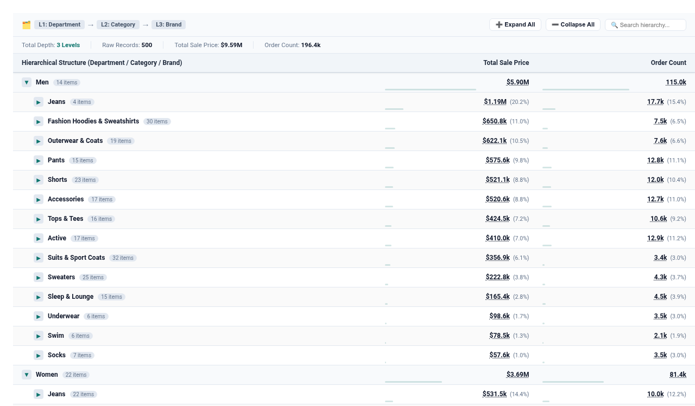

# Collapsible Hierarchical Tree Grid (`hierarchical_tree_table`)

An executive multi-level collapsible tree grid that solves Looker's #1 requested Table Cloud Blocker (**Buganizer `b/530833873`** and **`go/prd-looker-table-viz-improvements`**).

Rather than spreading nested hierarchies across wide, repetitive columns with excessive whitespace, this visualization consolidates any number of dimensions into a **single indented tree column** with interactive branch expansion, automatic multi-level subtotal rollups, in-cell share bars, and instant branch search.

---

## 💡 Inspiration & Cloud Blockers Solved

- **Buganizer Cloud Blocker `b/530833873`**: *Official Collapsible Tree Visualization*
- **PRD - Looker Table Viz Improvements (`go/prd-looker-table-viz-improvements`)**: *Hierarchical roll ups in a single column (CB): Provide a tree-like structure within the table where parent rows can be expanded to show child rows. The other dimensions and measures also show the breakdown at the expanded level.*
- **Internal YAQS (`go/yeng/7982871132560687104`)**: *Multi-level subtotals per parent dimension without whitespace table clutter.*

---

## 🚀 Key Features & Capabilities

- **Single-Column Indented Hierarchy**: Merges 2 to 6 nested parent-child dimensions (e.g. `Department > Category > Brand`, or `Region > Country > State > City`) into a single column with depth guides and level tags.
- **Dynamic Multi-Level Rollups**: Parent rows compute exact aggregate metrics of their descendants, providing effortless drillable subtotals.
- **Interactive Branch Controls**: Expand All / Collapse All buttons, clickable branch chevrons, and keyboard/mouse interaction.
- **In-Cell Performance Indicators**: Subtle background progress bars showing proportion of parent total, plus `(% share)` labels.
- **Branch Quick Search**: Real-time filtering that automatically auto-expands matching branches so matching leaves are immediately visible.
- **Looker Drill-Down Integration**: Clickable values with native Looker drill-down menus (`LookerCharts.Utils.openDrillMenu`).

---

## 📋 Data Requirements

| Field Type | Requirement | Examples |
| :--- | :--- | :--- |
| **Dimensions** | 2 to 6 Dimensions (Hierarchy Levels) | `products.department`, `products.category`, `products.brand` |
| **Measures** | 1 to 4 Numeric Measures | `order_items.total_sale_price`, `order_items.order_count` |

---

## 🎨 Configuration Options

### Section 1: Display
- **Tree Layout Mode**: `collapsible_tree` (interactive toggles), `flat_indented` (all expanded with subtotal banners), `compact_summary` (Level 1 summary only).
- **Default Tree Expansion**: `level1` (L1 expanded, deeper collapsed), `level2` (L1 & L2 expanded), `all` (expand all).
- **Show In-Cell Share Progress Bars**: Toggle progress bars in measure cells.
- **Show % of Parent Group Share**: Toggle `(XX.X%)` share badges.
- **Show Branch Search Filter**: Enable instant search box.
- **Show Executive Rollup Summary Bar**: Top banner displaying total depth, record count, and macro totals.
- **Primary Measure Value Format**: Compact Currency (`$1.2M`), Compact Number (`1.2M`), Raw (`1,234,567`).

### Section 2: Style
- **Visual Theme**: Executive Slate, Google Cloud Blue, Cyber NOC Dark, Emerald Enterprise.
- **Row Density / Padding**: Compact (28px), Normal (36px), Relaxed (44px).
