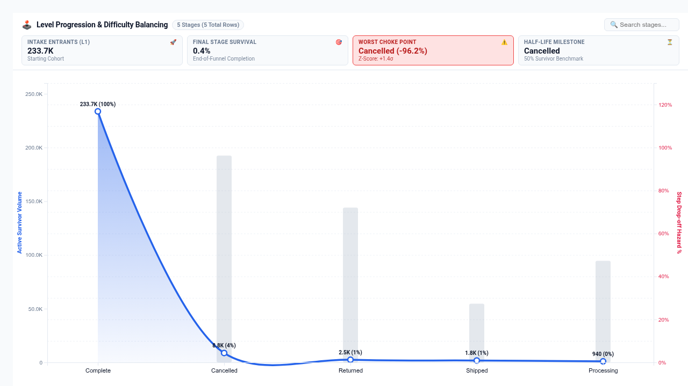

# Level Progression & Difficulty Balancing Curve Looker Custom Visualization

An enterprise-grade, high-performance game progression, difficulty balancing, and step-hazard attrition curve visualizer built with **D3.js v7** for Looker. Specifically engineered to resolve critical telemetry and game balancing limitations reported in Google-internal customer blockers (Buganizer `b/341928091`, `b/490547912`, and `b/530822261`) from leading mobile gaming and digital telemetry customers (e.g. King, EA, Scopely, Supercell, Google Play Games).

---

## 🎯 Executive Problem Solved

Traditional business intelligence Cartesian charts force game developers and product managers to choose between displaying raw survivor counts or simple drop-off bars. They cannot:
1. **Model Step-to-Step Hazard & Attrition Simultaneously**: Dynamically separate cumulative survivor volumes (Left Y-Axis) from marginal hazard churn rates % (Right Y-Axis).
2. **Automate Choke-Point Anomaly Detection**: Standard charts fail to identify when a drop-off rate is statistically anomalous (deviating > 1.5σ or 2.0σ from the baseline difficulty smoothing curve), hiding boss bottlenecks, overtuned levels, or tutorial abandonment.
3. **Model Theoretical Survival Baselines**: Lack theoretical power-law ($S(x) = x^{-\alpha}$) or exponential decay overlays to benchmark actual player retention against targeted game balance design.
4. **Scale to 5,000+ Level Milestones**: Crash or drop frames when ingesting high-density event logs with thousands of levels or user progression states.

---

## ✨ Key Capabilities & Highlights

- **4 Multi-Modal Layout Modes**:
  1. **Progression & Choke Points (`dual_axis_spikes`)**: Left axis smooth cubic spline/area for Cumulative Active Players; Right axis dual-scale marginal churn hazard % spikes with red warning badges on anomalous choke points.
  2. **Survival Decay Model (`survival_decay`)**: Compares empirical player retention curve against a mathematically fitted exponential/power-law benchmark baseline, with P50 half-life milestone indicator.
  3. **Milestone Step Waterfall (`milestone_waterfall`)**: Stepped progression cascade tracking surviving players passing each checkpoint paired with downward drop-off loss bars.
  4. **Difficulty & Pacing Envelope (`difficulty_pacing`)**: Correlates player attrition against secondary telemetry measures (attempts, retries, completion time, or in-game currency sinks).
- **Automated Choke-Point Anomaly Engine**:
  - Calculates marginal step hazard rate $h_i = \frac{V_{i-1} - V_i}{V_{i-1}} \times 100\%$.
  - Computes dynamic population mean ($\mu$) and standard deviation ($\sigma$) across all progression stages.
  - Flags levels with $Z > 1.5$ or $Z > 2.0$ with pulsing badges (`⚠️ CHOKE POINT: -X%`).
- **Strict Dual-Axis Architecture**:
  - Left Y-Axis: Survivor Volume / Retention % with clean formatted numbers.
  - Right Y-Axis: Step Hazard Churn Rate % or Secondary Telemetry Measure.
  - Adheres to Looker best practices: dual Y-axes with clean uncluttered labels.
- **Client-Side Scalability (5,000+ Rows)**:
  - Aggregates raw row-level session or event logs into level summaries in-browser using $O(N)$ Map rollups with instant sub-millisecond execution.
- **Executive Telemetry HUD**:
  - 4 real-time KPI tiles: **Intake Entrants (L1)**, **Final Stage Survival %**, **Worst Choke Point (with Z-Score)**, and **Half-Life Milestone (P50)**.
- **Instant Client-Side Filtering**:
  - Search-as-you-type filter to isolate specific stages, chapters, or difficulty tiers.
- **Streamlined 2-Tab Options Modal**:
  - Strictly organized into `Display` and `Style` tabs to prevent crowded or overlapping edit dialog headers in Looker.

---

## 📊 Data Shape & Query Requirements

The visualization supports flexible data shapes:

### Recommended Setup (Single Dimension + 1-2 Measures)
- **Dimension 1 (Level / Milestone / Stage)**: e.g. `levels.level_number`, `order_items.status`, `events.event_name`
- **Measure 1 (Active Survivors / Volume)**: e.g. `events.player_count`, `order_items.order_count`
- **Measure 2 (Optional Secondary Pacing Metric)**: e.g. `levels.avg_attempts`, `order_items.total_sale_price`, `events.playtime_seconds`

### Multi-Measure Mode (No Dimension)
- **2 to 12 Measures representing sequential milestones**: e.g. `Tutorial Completed`, `Level 5 Cleared`, `Boss Defeated`, `Endgame Reached`.

---

## ⚙️ Configuration Options

### Section 1: Display
- **Progression Layout Mode**: `Progression & Choke Points`, `Survival Decay Model`, `Milestone Step Waterfall`, `Difficulty & Pacing Envelope`
- **Choke Point Anomaly Sensitivity**: `High Sensitivity (> 1.5σ Churn)`, `Medium Sensitivity (> 2.0σ Churn)`, `Fixed Threshold (> 25% Churn)`
- **Show Executive Telemetry HUD**: Toggle top KPI summary tiles.
- **Flag Difficulty Choke Points**: Toggle visual warning flags on anomalous stages.
- **Show Value & Retention Labels**: Toggle data labels on points and bars.
- **Enable Instant Stage Search**: Toggle interactive search filter box.

### Section 2: Style
- **Color Theme**: `Executive Slate (Light - Default)`, `Cyber Teal (Dark)`, `Neon Violet (Dark)`, `Emerald Pulse (Light)`, `Sunset Amber (Light)`
- **Curve Interpolation**: `Smooth Spline (Catmull-Rom)`, `Linear (Direct Segment)`, `Monotone (Preserve Peaks)`
- **Area Shading Opacity**: `Subtle Fill (15%)`, `Medium Fill (30%)`, `Solid Fill (50%)`
- **Value Number Format**: `Compact Numbers (1.2M, 45K)`, `Currency Format ($1.2M)`, `Percentage Only`, `Exact Raw Integers`
- **Highlight Peak Bottleneck Level**: Automatically highlights the single worst drop-off stage.
