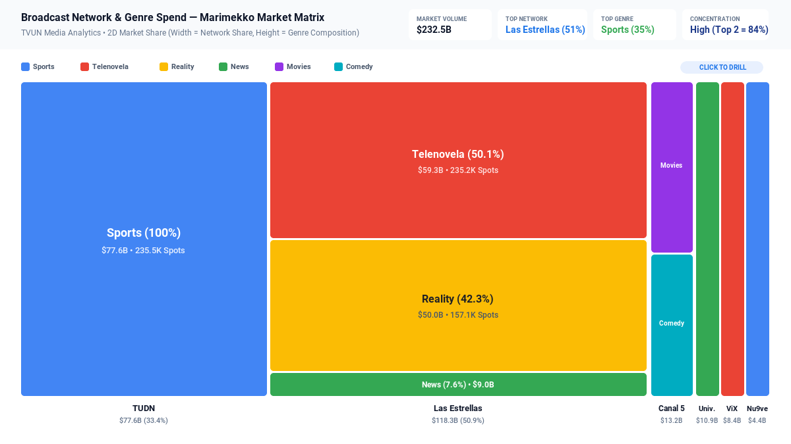

# Marimekko / Mosaic Market Matrix



An enterprise implementation of the **Marimekko / Mosaic Market Share Matrix** for Google Cloud Looker, engineered with **D3.js v7**.

A Marimekko chart (also known as a Mekko chart or Mosaic plot) is a specialized two-dimensional market share visualization where **both column widths and segment heights are scaled proportionally** to represent quantitative values. This provides instant visual clarity on market concentration, segment distribution, and revenue composition across two categorical hierarchies simultaneously.

---

## 📸 Key Features

- **Multi-Modal Analytical Layouts**:
  - `Marimekko (Variable-Width Mosaic Matrix)`: Both column width and segment height reflect metric volume (e.g. Broadcast Network spend share vs Content Genre composition).
  - `100% Stacked Market Share`: Normalized uniform column widths comparing internal categorical mix percentages.
  - `Heatmap Affinity Matrix`: Tabular cross-tabulation grid color-coded by market concentration and segment volume.
- **Dynamic Field-Role Mapping**: 1-based column index or field name overrides for Primary Column Category, Sub-Segment Category, Volume/Weight Metric, and Secondary Metric.
- **Configurable Target & Reference Modes**:
  - `Dataset Mean (Market Average Segment Share)`
  - `Dataset Median (Market Median)`
  - `Fixed Target %`
  - `Top Percentile P75 / P90 Benchmark`
- **Sorting & Top-N Bucketing**: Sort columns by Total Volume Descending/Ascending or Alphabetical; limit Top-N categories with automatic `'Other'` segment rollups.
- **Executive KPI HUD**: Top scorecard showing Market Leaders, Total Tracked Volume, Top Category Share %, and Anomaly Alerts.
- **Enterprise Brand Palettes**: Google Enterprise, Modern Slate, Cyberpunk Dark, Emerald FinOps, Sunset Media, Wellverse Healthcare, or Custom Hex overrides.
- **Interactive Tooltip & Native Drill Menus**: High-fidelity hover cards with 2D market percentages and seamless Looker drill-down menu integration (`LookerCharts.Utils.openDrillMenu`).

---

## 📊 Data Shape Requirements

| Field Type | Count | Purpose | Examples |
| :--- | :--- | :--- | :--- |
| **Dimension 1** | `1` *(Required)* | Primary Column Hierarchy (Width) | `broadcast_programming.network`, `store.region` |
| **Dimension 2** | `1` *(Required)* | Sub-Segment Hierarchy (Height / Color) | `broadcast_programming.genre`, `products.category` |
| **Measure 1** | `1` *(Required)* | Primary Volume / Revenue Metric | `ad_spot_airings.total_spend_mxn`, `sales.revenue` |
| **Measure 2** | `0` or `1` *(Optional)* | Secondary Metric (Spots, Volume, Margin)| `ad_spot_airings.total_airing_spots` |

---

## ⚙️ Configuration Options (Strict 2-Tab Layout)

### Tab 1: Display
| Option | Type | Default | Description |
| :--- | :--- | :--- | :--- |
| `layoutMode` | Select | `marimekko` | Visualization paradigm (`Marimekko`, `100% Stacked`, `Heatmap Grid`) |
| `dimFieldOverride` | String | `1` | 1-based index or name for Primary Column Dimension |
| `subDimOverride` | String | `2` | 1-based index or name for Sub-Segment Dimension |
| `measureFieldOverride`| String | `1` | 1-based index or name for Primary Measure |
| `secondaryMeasureOverride`| String | `2` | Optional 1-based index or name for Secondary Measure |
| `targetMode` | Select | `dataset_mean` | Reference target benchmark mode |
| `fixedTargetValue` | Number | `0` | Target % when Fixed Mode |
| `referenceLineLabel` | String | `Market Benchmark` | Reference line annotation label |
| `anomalyThresholdPct` | Number | `35` | Segment market share % triggering dominance alert |
| `sortBy` | Select | `metric_desc` | Sort order (`Volume Descending`, `Volume Ascending`, `Alphabetical`, `Natural`) |
| `topNLimit` | Number | `0` | Limit Top-N column categories (0 = All) |
| `enableOtherRollup` | Boolean | `true` | Roll up smaller categories into "Other" column |
| `suppressZeroNull` | Boolean | `true` | Suppress zero or null cells |
| `hudMode` | Select | `scorecard` | Executive KPI HUD (`Full Scorecard`, `Compact Strip`, `Hidden`) |
| `showValueLabels` | Select | `all` | Segment labels (`All`, `Dominant Peaks Only`, `Hidden`) |
| `customTitleOverride` | String | `""` | Custom chart title override |
| `showLegend` | Boolean | `true` | Display sub-segment color legend |
| `showSearch` | Boolean | `true` | Show interactive category search bar |

### Tab 2: Style
| Option | Type | Default | Description |
| :--- | :--- | :--- | :--- |
| `colorPalette` | Select | `google_enterprise` | Brand palette preset |
| `customPrimaryHex` | Color | `""` | Custom dominant brand color override |
| `customPositiveHex` | Color | `""` | Custom positive / target color override |
| `customNegativeHex` | Color | `""` | Custom alert / deficit color override |
| `metricPolarity` | Select | `higher_is_better` | Metric polarity toggle |
| `fontScale` | Select | `standard` | Typography scale (`Compact`, `Standard`, `Large`) |
| `valueFormat` | Select | `compact_currency` | Format (`Auto`, `Currency`, `Number`, `Percentage`, `Decimal`, `Raw`) |

---

## 🚀 Manifest Snippet (`manifest.lkml`)

```lookml
visualization: {
  id: "marimekko_market_matrix"
  label: "Marimekko / Mosaic Market Matrix"
  file: "visualizations/marimekko_market_matrix.js"
  dependencies: ["https://d3js.org/d3.v7.min.js"]
}
```
