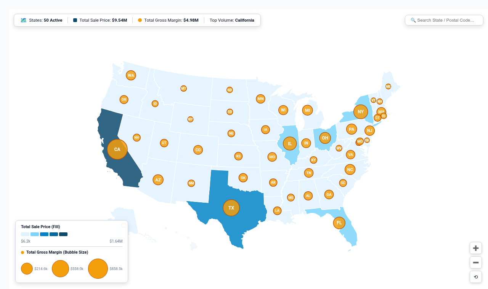

# Dual-Axis Multi-Layer Geospatial Map (`multi_layer_geo_map`)

A high-performance geospatial intelligence visualization solving Looker's premier Map Cloud Blocker (**Buganizer `b/243984441`** and **`go/prd-looker-map-viz-improvements`**).

Native Looker map visualizations are fundamentally constrained to plotting a single metric at a time. This visualization introduces an enterprise dual-axis geospatial engine that plots **two independent measures simultaneously** across geographic regions: **Choropleth Polygon Fills** for primary macro metrics (e.g. Sales Volume or Revenue) and **Proportional Centroid Bubble Pins** for secondary unit/efficiency metrics (e.g. Gross Margin, Order Count, or Latency).

---

## 💡 Inspiration & Cloud Blockers Solved

- **Buganizer Cloud Blocker `b/243984441`**: *Dual-Axis Maps in BI Products*
- **PRD - Looker Map Viz Improvements (`go/prd-looker-map-viz-improvements`)**:
  > *"Dual-Axis Maps in BI Products: As an Analyst, I should be able to plot multiple measures as distinct identifiers on a map. Google Map Viz should support multiple measures on the same map viz. Each measure should be displayed as an identifiable value. Analysts should be able to configure layers separately."*
- **Internal YAQS (`go/yeng/5766299557997936640`)**: *Choropleth color fill plus bubble pin overlay on a single geospatial canvas.*

---

## 🚀 Key Features & Capabilities

- **Dual-Axis Multi-Layer Engine**:
  - **Layer 1 (Choropleth)**: Continuous or quantile color gradient shading based on Primary Measure (e.g. Total Revenue).
  - **Layer 2 (Centroid Bubbles)**: Proportional circles plotted at true state geographic centroids sized according to Secondary Measure (e.g. Gross Margin).
- **4 Geospatial Projection Modes**:
  1. `dual_layer`: Synchronized Choropleth polygon fill + proportional bubble pins.
  2. `choropleth_only`: High-contrast pure boundary heatmap.
  3. `bubble_only`: Proportional bubble scatter map over subtle boundary outlines.
  4. `hex_cartogram`: Equal-area hexagonal state cartogram eliminating geographic landmass distortion (e.g. Rhode Island has equal visual prominence to Montana).
- **Synchronized Dual-Axis Legends**:
  - Gradient color bar for Layer 1 with minimum and maximum values.
  - Nested concentric circle scale for Layer 2 showing reference bubble sizes and metric values.
- **Executive KPI HUD & Search**:
  - Top header displaying total active states, aggregate macro totals for both measures, and top volume state.
  - Real-time search bar with instant state highlighting and centering.
- **Interactive Pan & Zoom**:
  - Smooth mouse wheel / pinch zoom with bounding constraint and floating reset button.
- **Looker Drill-Down Integration**:
  - Native Looker drill menus (`LookerCharts.Utils.openDrillMenu`) on click for dimensions and measures.

---

## 📋 Data Requirements

| Field Type | Requirement | Examples |
| :--- | :--- | :--- |
| **Dimension** | 1 Geographic Dimension (State Name, Postal Code, or FIPS) | `users.state`, `distribution_centers.state` |
| **Measures** | 1 to 3 Numeric Measures | `order_items.total_sale_price` (Primary Fill), `order_items.total_gross_margin` (Secondary Bubble), `order_items.order_count` |

---

## 🎨 Configuration Options

### Section 1: Display
- **Map Layer Mode**: `dual_layer` (Choropleth + Bubbles), `choropleth_only`, `bubble_only`, `hex_cartogram` (Hexagon Grid).
- **Secondary Bubble Metric**: Measure 2 or Measure 3.
- **Show Bubble State Labels**: `always`, `hover_only`, `hidden`.
- **Show Dual-Axis Legend**: Display synchronized color bar and bubble size scale card.
- **Show Executive KPI HUD**: Display top summary pill with national totals and top performer.
- **Show Quick State Search**: Enable real-time postal / state search input.
- **Primary / Secondary Value Format**: Compact Currency (`$1.2M`), Compact Number (`1.2M`), Percentage (`12.3%`), Raw (`1,234,567`).

### Section 2: Style
- **Color Palette Theme**: Google Blue & Amber, Viridis Spectrum, Emerald & Ruby, Sunset Violet, Cyber Dark NOC.
- **Bubble Scale Multiplier**: `0.8x`, `1.0x`, `1.2x`, `1.5x`, `2.0x`.
- **Choropleth Fill Opacity**: `0.50` to `1.00`.
