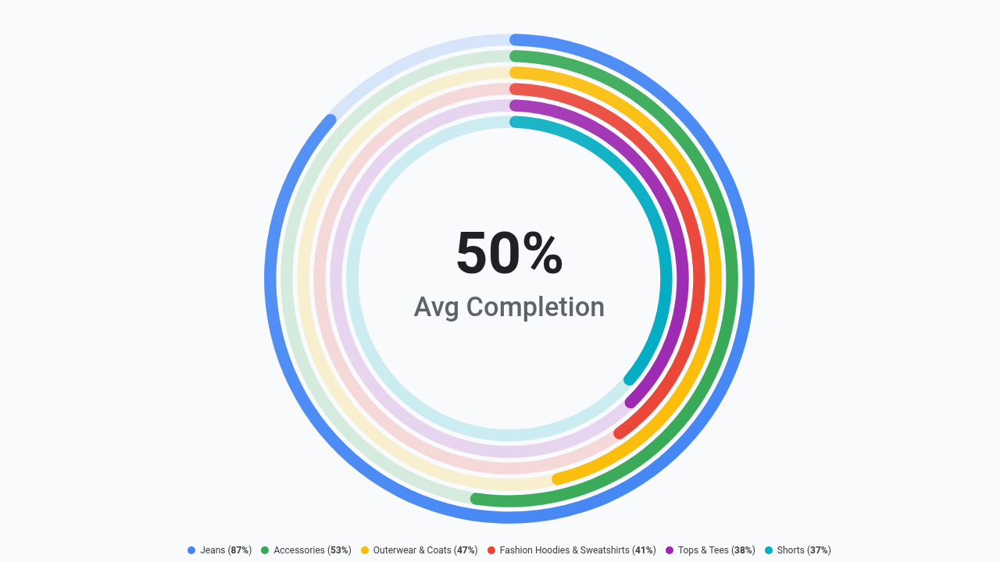

# Radial KPI Progress Gauge



A custom Looker visualization built with D3.js v7 providing multi-tier concentric progress rings inspired by Apple Watch fitness rings, executive quota gauges, and cloud capacity monitors.

## ✨ Flexibility & Feature Upgrade

This visualization features complete multi-modal layout flexibility strictly organized into **2 clean configuration tabs** (`Display` and `Style`) to prevent header clutter in Looker's Edit Viz modal:

### 🎯 Display Controls
- **Multi-Modal Gauge Layouts**: Concentric Rings (Apple Fitness multi-tier), Single Hero Ring with Sub-Gauges, Radial Dial Speedometer, and Small Multiples Grid.
- **Dynamic Field-Role Mapping**: Remap primary dimension, primary measure, and target measure using 1-based index numbers (e.g. `1`, `2`) or exact field names without modifying Looker Explore column orders.
- **Configurable Goals & Thresholds**:
  - `Measure Column`: Use a secondary measure directly from the query.
  - `Fixed Static Target`: Set a manual numeric target.
  - `Dataset Mean` & `Dataset Median`: Dynamic baseline centering.
  - `Percentile P75 / P90`: Benchmark attainment against upper quartile performers.
- **Attainment Anomaly Alerts**: Highlight metrics exceeding threshold goals (e.g. `>120%`).
- **Interactive Sorting & Top-N Bucketing**: Sort by Metric Descending, Ascending, Alphabetical, or Natural Query Order. Optionally rollup long tails into an automatic `'Other'` category.
- **Executive KPI HUD & Search Bar**: Full Scorecard HUD with Average Attainment, Total Active Volume, Leading Driver, and real-time category filter search.

### 🎨 Style & Typography
- **Preset Brand Palettes**: Google Enterprise, Modern Slate, Cyberpunk Dark, Emerald FinOps, Sunset Media, Wellverse Healthcare, and Custom Hex Override.
- **Custom Hex Overrides**: Specify primary brand, positive success, and negative alert colors.
- **Metric Polarity**: Toggle between `Higher is Better` (Sales, Orders, Completion) and `Lower is Better` (Latency, Churn, Defect, Cost).
- **Typography & Font Scaling**: Switch between `Compact`, `Standard`, and `Large Presentation` scales.
- **Adaptive Value Formats**: Auto (Looker field formats), Compact Numbers (`1.2M`), Compact Currency (`$1.2M`), Percentage (`45.2%`), Decimal, or Raw.

---

## 📊 Recommended Data Shapes
1. **Dimension + Measure View** (Recommended): 1 Category dimension (e.g. `products.category`) and 1 Primary measure (e.g. `order_items.total_sale_price`), with optional 2nd measure for Quota Target.
2. **Multi-Measure Scorecard**: 1 row with 2 to 6 numeric measures (e.g. `Revenue`, `Orders`, `AOV`, `Margin`).

---

## 🚀 Setup & Manifest
```lookml
visualization: {
  id: "radial_progress_gauge"
  label: "Radial KPI Progress Gauge"
  file: "visualizations/radial_progress_gauge.js"
  dependencies: ["https://d3js.org/d3.v7.min.js"]
}
```
