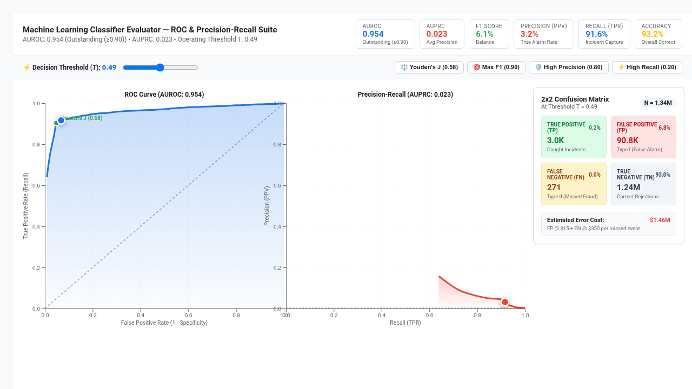

# ROC / PR & Confusion Matrix Classifier Evaluator



An executive **Machine Learning Classifier Evaluation Suite** custom visualization for Google Cloud Looker, engineered with **D3.js v7**.

Evaluates binary classification models output by **BigQuery ML** (`ML.ROC_CURVE`, `ML.CONFUSION_MATRIX`, `ML.EVALUATE`), Vertex AI, and standard data science pipelines for fraud detection, customer churn prediction, risk scoring, and security threat triage.

---

## 📸 Key Features

- **Multi-Modal Visual Paradigms (`Display`)**:
  - `Dual View`: Synchronized side-by-side ROC (Receiver Operating Characteristic) and PR (Precision-Recall) curves.
  - `ROC Curve`: True Positive Rate (Recall) vs False Positive Rate (1 - Specificity) with random-guess diagonal baseline ($y = x$) and AUROC calculation.
  - `Precision-Recall Curve`: Precision vs Recall with prevalence baseline and AUPRC calculation.
  - `Threshold Metrics Tradeoff`: Multi-line chart tracking F1 Score, Accuracy, Precision, and Recall across decision thresholds ($0.0 \to 1.0$).
- **Interactive Threshold Scrubber Slider (`Display`)**: Live horizontal range slider allowing users and decision makers to scrub through candidate classification thresholds. Snaps instantly to dataset points, updating curve markers and the Confusion Matrix in real-time.
- **Operating Point Presets (`Display`)**:
  - `⚖️ Youden's Index J`: Snaps to the optimal cutoff maximizing sensitivity and specificity ($J = \text{TPR} - \text{FPR}$).
  - `🎯 Max F1-Score`: Snaps to the cutoff maximizing the harmonic mean of precision and recall.
  - `🛡️ High Precision (0.80)`: Prioritizes low false alarms (Type I error mitigation).
  - `⚡ High Recall (0.20)`: Prioritizes maximum incident capture (Type II error mitigation).
- **Live 2x2 Confusion Matrix (`Display`)**: Interactive contingency table displaying True Positives (TP), False Positives (FP), True Negatives (TN), and False Negatives (FN) with population percentages and error highlights.
- **Financial Opportunity Impact / Cost Calculator (`Display`)**: Configurable cost per False Positive ($) and False Negative ($) computing projected business loss: $\text{Total Cost} = (\text{FP} \times \text{Cost}_{\text{FP}}) + (\text{FN} \times \text{Cost}_{\text{FN}})$.
- **Executive Scorecard HUD (`Display`)**: High-level KPI banner showing AUROC with clinical discrimination ratings (*Outstanding $\ge 0.90$*, *Excellent $0.80 - 0.90$*, *Acceptable $0.70 - 0.80$*), AUPRC, F1 Score, Precision, Recall, and Accuracy.
- **Enterprise Brand Palettes (`Style`)**: Google Enterprise, Modern Slate, Cyberpunk Dark, Emerald FinOps, Sunset Media, Wellverse Healthcare, and Custom Hex Overrides.
- **Responsive Architecture**: Debounced `<4px` ResizeObserver guard, zero container overflow, and Looker drill-down menu support.

---

## 📊 Data Shape Requirements

| Field Type | Required / Optional | Purpose | Examples |
| :--- | :--- | :--- | :--- |
| **Threshold** | **Required** | Decision cutoff point ($0.0 \to 1.0$) | `roc_curve.threshold` |
| **False Positive Rate (FPR)** | **Required** | Type I error rate ($1 - \text{Specificity}$) | `roc_curve.false_positive_rate` |
| **Recall / TPR** | **Required** | Sensitivity / Incident capture rate | `roc_curve.recall` |
| **Precision** | **Required** | Positive Predictive Value (PPV) | `roc_curve.precision` |
| **F1 Score** | Optional | Harmonic mean of Precision and Recall | `roc_curve.threshold_f1` |
| **Accuracy** | Optional | Overall correct classification rate | `roc_curve.threshold_accuracy` |
| **True Positives (TP)** | Optional (Recommended) | Count of correctly caught events | `roc_curve.true_positives` |
| **False Positives (FP)** | Optional (Recommended) | Count of false alarms | `roc_curve.false_positives` |
| **True Negatives (TN)** | Optional (Recommended) | Count of correctly cleared cases | `roc_curve.true_negatives` |
| **False Negatives (FN)** | Optional (Recommended) | Count of missed incidents | `roc_curve.false_negatives` |

---

## ⚙️ Configuration Options (Strictly 2 Sections)

### Section: `Display`
- `curveType`: Evaluation View Mode (`dual_view`, `roc`, `pr`, `threshold_metrics`)
- `thresholdFieldOverride`: Decision Threshold Field Index or Name
- `fprFieldOverride`: False Positive Rate Field Index or Name
- `recallFieldOverride`: Recall / TPR Field Index or Name
- `precisionFieldOverride`: Precision Field Index or Name
- `f1FieldOverride`: F1 Score Field Index or Name
- `accuracyFieldOverride`: Accuracy Field Index or Name
- `tpFieldOverride`: True Positives Count Field Index or Name
- `fpFieldOverride`: False Positives Count Field Index or Name
- `tnFieldOverride`: True Negatives Count Field Index or Name
- `fnFieldOverride`: False Negatives Count Field Index or Name
- `optimalMarker`: Optimal Operating Point Recommendation (`youden_j`, `max_f1`, `none`)
- `initialThreshold`: Initial Decision Threshold (default: `0.50`)
- `showConfusionMatrix`: Show Live 2x2 Confusion Matrix Card (default: `true`)
- `showAUCScore`: Show AUROC & AUPRC in Scorecard HUD (default: `true`)
- `showCostModel`: Enable Financial Impact / Error Cost Calculator (default: `true`)
- `costPerFP`: Cost per False Positive ($) (default: `15`)
- `costPerFN`: Cost per False Negative / Missed Incident ($) (default: `350`)
- `hudMode`: Executive Model Scorecard HUD (`scorecard`, `compact_strip`, `hidden`)
- `customTitleOverride`: Custom Scorecard Title Override
- `showGridLines`: Show Axis Grid Lines (default: `true`)

### Section: `Style`
- `colorTheme`: Brand Palette Preset (`google_enterprise`, `modern_slate`, `cyberpunk_dark`, `emerald_finops`, `sunset_media`, `wellverse_healthcare`, `custom`)
- `customPrimaryHex`: Custom ROC Curve Color (Hex)
- `customAccentHex`: Custom PR Curve Color (Hex)
- `fontScale`: Typography Font Scale (`compact`, `standard`, `large`)
- `valueFormat`: Number & Probability Formatting (`percentage`, `decimal_2`, `compact_number`)
- `curveStrokeWidth`: Curve Stroke Width (px) (default: `3`)
- `enableAreaFill`: Enable Gradient Fill Under Curves (default: `true`)
- `enableAnimation`: Enable Smooth Entry Transitions (default: `true`)

---

## 🚀 Manifest Snippet (`manifest.lkml`)

```lookml
visualization: {
  id: "roc_curve_evaluator"
  label: "ROC / PR & Confusion Matrix Evaluator"
  file: "visualizations/roc_curve_evaluator.js"
  dependencies: ["https://d3js.org/d3.v7.min.js"]
}
```
