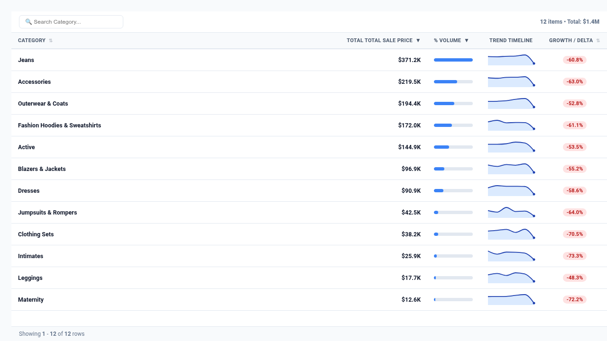

# Sparkline Metric Matrix Table




An executive **Sparkline Metric Matrix Table** custom visualization for Google Cloud Looker, engineered with **D3.js v7**.

Standard Looker tables struggle to display multi-period performance without spreading wide across dozens of monthly or quarterly columns. This visualization collapses temporal pivots into compact in-cell SVG trend sparklines, adds micro bullet bars showing proportional volume, and calculates period-over-period growth variance pills—all within an interactive, searchable scorecard grid.

---

## 📸 Key Features

- **Multi-Modal Display Modes**:
  - `Sparkline Matrix` (Default): In-cell SVG trend sparklines + volume micro bullet bars + period growth percentage delta pills.
  - `Heatmap Matrix`: Dense color-intensity heatmap matrix across pivot periods or metrics with contrast-adjusted text values.
  - `Compact Scorecard`: Executive KPI scorecard with performance status badges (`Top Performer`, `Stable Growth`, `Under Target`), share-of-volume bars, and ranks.
- **5,000+ Row Expanded Row Limit Support**: High-density client-side pagination (`15`, `25`, `50`, `100`, `All`) capable of processing and sorting massive datasets without layout thrashing or browser DOM lag.
- **In-Cell Trend Sparklines**: SVG micro-charts featuring shaded gradient area fills, peak markers (emerald green), trough markers (rose red), and current outcome points.
- **Proportional Micro Bullet Bars**: In-cell volume bars visualizing row-level contribution relative to the maximum row.
- **Period Growth Variance Pills**: Automatic calculation of percentage delta between the earliest and latest pivot period with directional color-coding.
- **Interactive Quick Search Filter**: Real-time client-side search filtering across categorical dimensions.
- **Click-to-Sort Headers**: Sort by Item Name, Total Aggregated Metric, Volume, Growth Delta, or Individual Pivot Columns.
- **Sticky Summary Footer**: Grand total roll-up summarizing record counts and aggregate metric values.
- **Native Looker Drill-Downs**: Click any row to launch Looker's contextual drill overlay.
- **4 Executive Color Themes**:
  - `Executive Slate` (Neutral slate headers, cobalt sparklines, emerald/crimson pills)
  - `Google Vibrant` (Google Slate, Blue, Green, Red)
  - `Emerald Growth` (Mint, forest green, and teal)
  - `Midnight Cyber` (High-contrast dark mode with neon sky blue)

---

## 📊 Data Shape Requirements

Supports two distinct query structures:

### Option A: Pivoted Time-Series (Recommended)
| Field Type | Required Count | Purpose | Example (`order_items`) |
| :--- | :--- | :--- | :--- |
| **Dimension** | `1` *(Required)* | Row Grouping | `products.category`, `users.state`, `sales_reps.name` |
| **Pivot** | `1` *(Required)* | Temporal Period | `order_items.created_month`, `order_items.created_quarter` |
| **Measure** | `1` *(Required)* | Metric to trend | `order_items.total_sale_price`, `order_items.count` |

### Option B: Multi-Measure Matrix
| Field Type | Required Count | Purpose | Example (`order_items`) |
| :--- | :--- | :--- | :--- |
| **Dimension** | `1` *(Required)* | Row Grouping | `products.category` |
| **Measures** | `2–6` *(Required)* | Metric comparisons | `order_items.total_sale_price`, `order_items.total_gross_margin` |

---

## ⚙️ Configuration Options

| Option | Type | Default | Description |
| :--- | :--- | :--- | :--- |
| `tableMode` | Select | `Sparkline Matrix` | Display mode (`sparkline_matrix`, `heatmap_grid`, `compact_scorecard`) |
| `pageSize` | Select | `25 Rows per Page` | Pagination limit for 5,000+ row datasets (`15`, `25`, `50`, `100`, `all`) |
| `colorTheme` | Select | `Executive Slate` | Palette theme (`executive_slate`, `google_vibrant`, `emerald_growth`, `midnight_cyber`) |
| `showSparklines` | Boolean | `true` | Display in-cell SVG trend sparklines |
| `showMicroBars` | Boolean | `true` | Display in-cell proportional volume bars |
| `showVarianceBadge` | Boolean | `true` | Display period growth percentage pills |
| `showSearch` | Boolean | `true` | Enable top quick-search filter input |
| `showSummaryRow` | Boolean | `true` | Display grand total rollup header/summary |
| `valueFormat` | Select | `Compact Currency` | Numeric formatting (`compact_currency`, `full_currency`, `compact_number`, `full_number`, `percent`) |
| `rowHeight` | Number | `46` | Row height in pixels |

---

## 🚀 Manifest Snippet (`manifest.lkml`)

```lookml
visualization: {
  id: "sparkline_matrix_table"
  label: "Sparkline Metric Matrix Table"
  file: "visualizations/sparkline_matrix_table.js"
  dependencies: ["https://d3js.org/d3.v7.min.js"]
}
```
